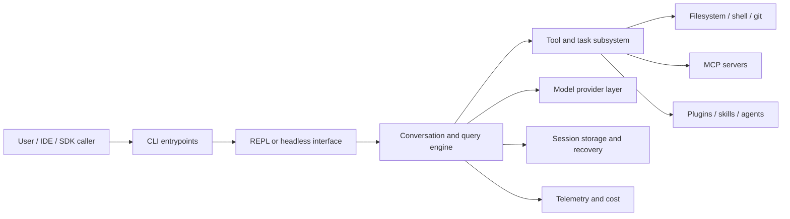
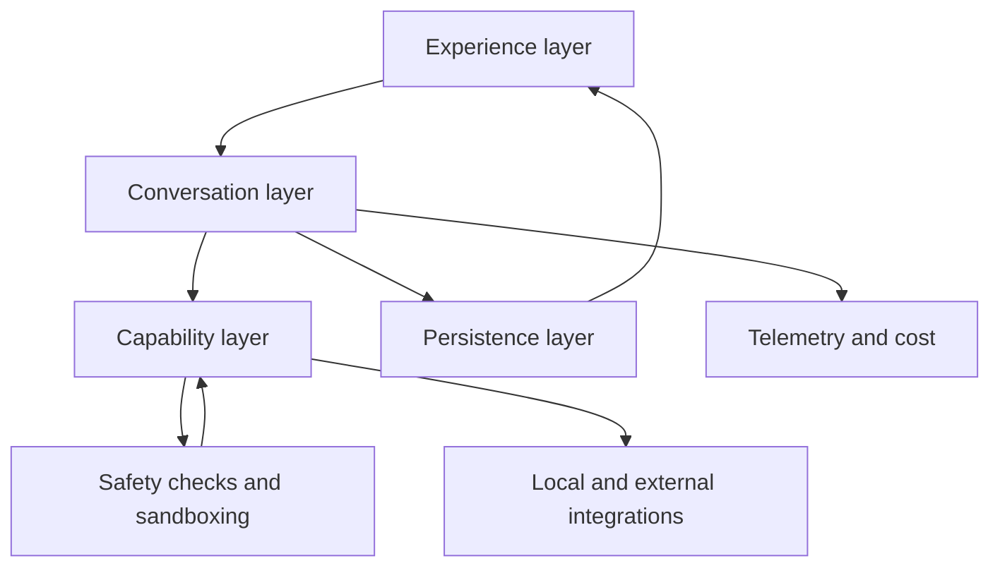

# Chapter 1 - Overview

## What Claude Code is

Claude Code is a terminal-first coding assistant. Its core job is not just to generate text, but to operate a software engineering workflow:

- accept user intent through a CLI or TUI
- build a model-facing conversation state
- expose a controlled set of tools
- execute tool-assisted work under safety constraints
- persist and recover long-running sessions
- integrate with external services, extensions, and remote hosts

The most useful mental model is:

> **Claude Code is an orchestration runtime for agentic software engineering, wrapped in a terminal UX.**

## What Claude Code is not

It is also helpful to define the system by contrast.

Claude Code is **not** primarily:

- a thin shell around a single API call
- a normal REPL that happens to print model output
- a pure plugin host with no strong internal runtime model
- a typical IDE extension centered on editor APIs

Those interpretations all miss something essential. Claude Code makes much more sense when it is viewed as a stateful orchestration environment that happens to expose itself through terminal interfaces.

## Architectural layers

Claude Code is easiest to understand as a set of stacked layers.

| Layer | Responsibility | Representative areas |
| --- | --- | --- |
| Experience layer | User-facing commands, prompts, screens, dialogs, keyboard handling | `src/main.tsx`, `src/commands.ts`, `src/screens/`, `src/components/`, `src/keybindings/` |
| Conversation layer | Turn lifecycle, prompt assembly, streaming, retries, history shaping | `src/QueryEngine.ts`, `src/query.ts`, `src/utils/queryContext.ts` |
| Capability layer | Tools, tasks, agents, skills, and execution orchestration | `src/Tool.ts`, `src/tools.ts`, `src/tools/`, `src/services/tools/`, `src/tasks/` |
| Safety layer | Permissions, approvals, sandboxing, settings, and policy gates | `src/utils/permissions/`, `src/components/permissions/`, `src/utils/settings/`, `src/utils/sandbox/` |
| Integration layer | Providers, MCP, plugins, bridge, remote, LSP, web, auth | `src/services/api/`, `src/services/mcp/`, `src/plugins/`, `src/skills/`, `src/bridge/`, `src/remote/` |
| Persistence and operations layer | Session storage, recovery, telemetry, tracing, cost, diagnostics | `src/utils/sessionStorage.ts`, `src/utils/conversationRecovery.ts`, `src/services/analytics/`, `src/cost-tracker.ts` |

These layers are not perfectly isolated, but they are a useful abstraction because they reveal the dominant direction of responsibility:

- the experience layer initiates work
- the conversation layer decides how work unfolds
- the capability layer performs work
- the safety layer constrains work
- the integration layer expands where work can go
- the persistence and operations layer keeps work durable and observable

## Core nouns and ecosystem terms

Several terms recur across Claude Code and are worth defining early.

| Term | Practical meaning in Claude Code |
| --- | --- |
| **Session** | The durable unit of user work, including transcript, metadata, and side effects |
| **Turn** | One user-initiated iteration through the query loop, which may contain several internal model/tool cycles |
| **Tool** | A runtime action surface exposed to the model and governed by validation, permissions, and result mapping |
| **Command** | A user-facing control surface in the CLI/TUI, often routing to local logic or model work |
| **Skill** | Reusable operational knowledge or prompt packaging integrated into runtime discovery |
| **Task** | A background or durable work unit that can be queried later |
| **Agent** | A delegated execution context with its own scope, tools, and lifecycle |
| **Policy** | The set of settings, rules, and enterprise constraints that shape what the runtime may do |
| **MCP (Model Context Protocol)** | The protocol Claude Code uses to connect to external tool and resource providers in a standardized way |
| **LSP (Language Server Protocol)** | A standard interface for language-aware tooling such as semantic navigation and analysis |
| **REPL** | The interactive read-eval-print loop through which a user drives an ongoing terminal session |
| **TUI** | The text user interface layered on top of terminal rendering, dialogs, selectors, and status surfaces |
| **Ink** | The React-based terminal UI framework Claude Code uses to compose its interactive screen layer |
| **JSONL** | A line-oriented JSON storage format used for durable transcript data |
| **memdir** | Claude Code's file-based durable memory directory, organized around `MEMORY.md` and topic files |
| **Worktree** | A separate git working directory used to isolate concurrent lines of work without leaving the same repository history |

These nouns matter because Claude Code repeatedly translates between them. For example:

- a **command** may produce a **turn**
- a **turn** may invoke one or more **tools**
- a **tool** may spawn an **agent** or create a **task**
- a **session** persists all of the above under one durable identity
- **policy** shapes which of those transitions are even legal

## One state model

Claude Code keeps several overlapping state containers, each with a different durability boundary and operational role.

| Thing | What it mainly holds | Typical lifetime |
| --- | --- | --- |
| **Session** | transcript, metadata, task references, cost, mode-related posture | multi-turn, resumable |
| **Turn** | one user request plus the model/tool loop needed to settle it | one visible request |
| **Task** | durable background handle for work that may finish later | until completion or explicit stop/retrieval |
| **Agent / subagent** | a delegated execution context with its own prompt, tool scope, and transcript | per delegated assignment |
| **Teammate** | the concrete swarm participant that carries a worker through a backend such as tmux, iTerm, or in-process execution | per coordinated team run, sometimes persisted for resume |
| **Memory surface** | instruction files, auto memory, session memory, agent memory, and team memory | varies from one turn to long-lived |

The important hierarchy is:

- the **session** is the durable umbrella
- a **turn** is one iteration inside that session
- a **task** is a durable handle for ongoing work associated with the session
- an **agent** is the delegated worker logic
- a **teammate** is the concrete swarm carrier for that worker when coordination is involved

That distinction matters because the same ongoing work can appear in several subsystems at once. A background worker can be an **agent** from the tool layer, a **task** from the durability layer, and a **teammate** from the swarm layer without those words meaning the same thing.

## The word `mode` names four different things

One source of confusion in Claude Code is that the same everyday word is reused for several different runtime ideas.

| Mode family | Typical examples | What it changes |
| --- | --- | --- |
| **Execution mode** | interactive, non-interactive, remote/viewer, bridge | shell, transport, and I/O contract |
| **Permission mode** | `default`, `plan`, `acceptEdits`, `bypassPermissions`, `dontAsk`, `auto` | how tool requests are approved, denied, or automated |
| **Prompt identity** | default, custom, agent, coordinator, proactive addendum | what Claude Code is told it is and how it should behave |
| **Session-stable latches** | AFK header latch, fast-mode latch, cache-editing latch, thinking-clear latch | whether prompt-shaping headers stay sticky for cache stability |

These narrower terms matter because Claude Code controls them through different subsystems. Prompt assembly determines **prompt identity**, the safety layer determines **permission mode**, and startup/bootstrap logic determines **execution mode** and session-stable runtime posture.

## Two kinds of authority

Claude Code also has two different kinds of authority that should not be blended:

- **reasoning authority** shapes what the model is told: system prompt selection, command prompts, `CLAUDE.md`, tool descriptions, and dynamic attachments
- **execution authority** shapes what the runtime will actually permit: settings, managed policy, permission rules, and sandbox boundaries

This distinction keeps prompt construction and runtime enforcement from being conflated. Claude Code may be instructed to prefer a workflow by prompt and repository guidance, while the runtime still reserves the right to deny or sandbox the corresponding action.

## System context



## Dependency directions

The diagram above shows system adjacency. The more important question is: **which way does responsibility flow?**



The key idea is that the conversation layer sits in the middle. It mediates between user intent, available capabilities, and durable state. That central role is why `QueryEngine`, `query.ts`, and their surrounding utilities keep reappearing across the architecture.

## How the major subsystems interact

Claude Code is organized around a small number of high-value interfaces between layers.

### UX to engine

The interaction layer does not speak directly to providers or tools. It turns user actions into normalized commands, prompts, or local operations, and then hands those off to the query/runtime layer. This separation is what allows the same core engine to support both a rich REPL and structured/headless paths.

### Engine to capabilities

The query engine never edits files or spawns subprocesses directly as a primary abstraction. Instead, it reasons through tools. This keeps action taking visible, interceptable, and consistent across local tools, MCP, delegated agents, and background tasks.

### Safety across everything

The safety layer sits beside execution rather than underneath it. Permissions, settings, and sandbox rules shape both what the model can attempt and what the runtime will actually allow. That gives Claude Code a repeated pattern: capability is always filtered through policy.

### State beneath everything

Session state and persistence sit underneath most workflows. The UI reads it, the query engine updates it, tasks extend it, and resume logic reconstructs it. This explains why state code appears in places that are not obviously about storage.

### Operations around everything

Telemetry, diagnostics, tracing, and cost tracking are not conceptually "outside" the app. They wrap nearly every major flow:

- startup needs to identify the session and initialize counters
- query execution needs usage and timing data
- tools need progress and error visibility
- persistence needs enough metadata to make recovery debuggable

Operational concerns therefore act like a horizontal slice across the rest of the architecture.

## Three recurring control loops

Claude Code repeatedly returns to three loops:

1. **Interaction loop**: collect user intent, render feedback, and keep the session navigable.
2. **Execution loop**: build prompt context, call the model, execute tools, and continue until the turn resolves.
3. **Durability loop**: persist state, restore interrupted work, and keep long-running workflows coherent across restarts.

These loops overlap. A single user message can trigger all three.

For a concrete example, a single `/review`-style interaction might:

1. start in the **interaction loop** as a command parsed from the prompt surface
2. enter the **execution loop** as a model-guided tool-using task
3. update the **durability loop** by writing transcript and task metadata for later resume or inspection

Another way to describe Claude Code is that it is built to keep these loops from fighting each other:

- the interaction loop wants responsiveness
- the execution loop wants correctness and capability richness
- the durability loop wants continuity and recoverability

Much of the system design is about reconciling those goals rather than maximizing any one of them in isolation.

## One request through the whole architecture

A concrete walkthrough makes the abstractions less slippery. Imagine the user asks for a review of the current branch.

**Example:** if the user instead asks Claude Code to rename a helper, update the affected tests, and explain the change, the same cross-layer pattern still applies. The interaction layer captures the request, the submission pipeline may attach selection or file context, the query engine builds the request envelope, the model emits tool calls, the tool layer executes them under policy, and the session/operations layers preserve the resulting work as durable session state. A "small" request is therefore already a full-system traversal.

1. The **interaction layer** captures the request as prompt text, or as a slash-command-style workflow that eventually produces prompt text.
2. The **submission pipeline** may enrich that request with IDE selection, pasted content, attachments, hook-generated context, or mode-specific metadata.
3. The **conversation layer** assembles the current request envelope: system prompt sections, prior messages, visible tools, session-specific memory, and mode/policy headers.
4. The **model** begins streaming an answer, but may decide that text alone is insufficient and emit one or more tool requests.
5. The **capability layer** validates those requests, checks permissions, runs hooks, executes tools, and converts the results back into conversation artifacts.
6. The **conversation layer** resumes the loop with updated state, possibly repeating model and tool cycles several times before the turn settles.
7. The **persistence and operations layers** record transcript state, task identity, usage, timing, and cost so the work can later be resumed, inspected, or optimized.

Several important consequences follow from this walkthrough.

- The user experiences **one request**, but the runtime may perform many internal transitions.
- The model never acts directly on the world; it acts through a **capability surface that the runtime curates**.
- A session is not just memory for better prompts; it is the mechanism that lets the system preserve the meaning of ongoing work across retries, compaction, delegation, and restart.

## Where the layers intentionally leak

The layer model is useful, but Claude Code is not trying to enforce textbook isolation. Some concepts deliberately appear in more than one layer because they are product-level invariants rather than local implementation details.

**Example:** permission state is visible in the UI, influences which tools the model sees, and shapes how session recovery is interpreted later. That means safety is simultaneously a user-facing concept, a query-engine concern, and a persistence concern. The apparent layer leak is intentional because "what the agent is allowed to do" must stay coherent everywhere.

The most important leaks are:

- the **UI knows about safety state**, because approvals, warnings, and mode posture must be visible to the user
- the **query engine knows about tools and policy**, because prompt construction depends on the effective capability surface
- the **tool layer knows about session and UI concerns**, because progress, attachments, and durable task identity are part of the meaning of tool execution
- the **persistence layer knows about execution structure**, because resuming a session requires more than replaying plain text
- the **startup layer knows about build shape**, because optional product branches affect which commands, tools, and transports even exist

These leaks are not accidental. They show where the product's guarantees cut across subsystem boundaries. Claude Code promises continuity, constrained action, and multi-mode operation; those promises cannot be implemented if each subsystem behaves as though it lives in isolation.

## Why Claude Code feels larger than a normal CLI

Several forces make Claude Code structurally bigger than a typical terminal application:

- it has to act as both a product and a runtime platform
- it supports several operating modes with different I/O contracts
- it exposes multiple extension systems
- it treats long-lived state and recovery as first-class concerns
- it carries significant safety and policy machinery inside the execution path

In practice, this means Claude Code contains a lot of infrastructure that would be absent from a one-shot command-line tool.

There is also a multiplication effect: each major concern has to work in several runtime personalities. For example:

- command handling exists in both interactive and headless-friendly forms
- permissions exist with both UI and non-UI behavior
- session state must be meaningful both locally and remotely
- tools must support both immediate and durable/background use cases

This creates breadth, but it is principled breadth rather than accidental sprawl.

## Repository shape

Several directories matter more than the raw file count suggests:

- `src/main.tsx` is the runtime switchboard.
- `src/commands.ts` is the command inventory and dispatcher hub.
- `src/QueryEngine.ts` and `src/query.ts` are the core agent loop.
- `src/Tool.ts` and `src/tools.ts` define what the assistant can do.
- `src/services/` holds external-system integrations.
- `src/utils/` is the shared infrastructure layer, especially for settings, permissions, sandboxing, session storage, model handling, and telemetry.
- `src/bridge/`, `src/remote/`, `src/tasks/`, and `src/coordinator/` represent advanced operating modes rather than incidental utilities.

## How to read the implementation alongside this book

If you want to follow the implementation while reading, the easiest sequence is:

1. start at `src/main.tsx` to understand runtime entry and mode selection
2. read `src/commands.ts` and `src/Tool.ts` to understand the two main control surfaces
3. read `src/QueryEngine.ts` and `src/query.ts` to understand the execution core
4. read `src/utils/permissions/`, `src/utils/settings/`, and `src/utils/sandbox/` to understand what constrains action
5. read `src/services/`, `src/bridge/`, and `src/utils/sessionStorage.ts` to understand how the core integrates outward and persists inward

This order mirrors the lifecycle of actual usage: startup, intent capture, execution, constraint, and continuity.

## The most important concepts

### 1. The terminal UI is a control plane, not just a shell wrapper

The user experience combines:

- typed prompts
- slash commands
- dialogs and approvals
- background task visibility
- mode switching
- resumable session behavior

That means the UX layer is tightly coupled to runtime state, not just to output rendering.

### 2. The query engine is the center of gravity

The system revolves around a loop that repeatedly:

1. assembles context
2. calls a model
3. interprets tool requests
4. executes tools
5. feeds tool results back into the conversation
6. persists the resulting state

This makes Claude Code look more like an event-driven workflow engine than a classic request/response CLI.

### 3. Tools are the primary execution abstraction

Many seemingly different features are unified under the same execution idea:

- shell commands
- file operations
- web and MCP access
- delegated agents
- planning transitions
- durable tasks

This is one of the strongest organizing principles in Claude Code.

### 4. Safety is interwoven with execution

Permissions, sandboxing, settings precedence, and enterprise policy are not bolted on at the edge. They participate directly in:

- which tools exist
- how tools are displayed to the model
- whether a tool call is allowed
- whether a tool can run in the current context
- how settings and policy reshape the runtime

### 5. Claude Code has multiple personalities

Claude Code supports:

- an interactive REPL
- non-interactive/headless invocation
- SDK and structured output flows
- bridge and remote control scenarios
- agent delegation and background tasks

This explains why startup, state, and I/O paths are more elaborate than a normal CLI.

### 6. Claude Code is optimized for long-running work

Many design choices make more sense if the expected usage pattern is not "ask one question and quit," but instead:

- keep a session alive
- delegate work
- resume later
- move between modes or transports
- preserve enough state to keep context coherent

This is why persistence, recovery, and operational tracking appear so central.

It also explains why Claude Code cares so much about:

- context compaction instead of only fresh turns
- background task visibility instead of only immediate results
- remote and bridge operation instead of only local interaction
- cumulative cost and telemetry instead of only per-request stats

## A representative whole-system sketch

A simplified shape of Claude Code's runtime looks like this:

```ts
const input = readUserInput()

const routed = routeInput(input, {
  commands,
  attachments,
  currentMode,
})

const context = buildContext({
  session,
  promptAssets,
  tools,
  permissions,
})

const result = await runQueryLoop(routed, context)

await persistSession({
  messages: result.messages,
  tasks: result.tasks,
  metadata: result.metadata,
})

renderToUser(result)
```

This is intentionally simplified, but it captures the most important architectural rhythm: Claude Code routes input, assembles context, runs the query/tool loop, persists the resulting session state, and only then projects the result back through the UI. Later chapters zoom in on each line of that sketch.

## Repository-wide design themes

A few design themes recur across Claude Code:

- **Feature-gated product shape:** one codebase can assemble several runtime personalities.
- **Session durability:** conversations, tasks, and operational metadata are treated as recoverable work state.
- **Layered extensibility:** plugins, skills, MCP servers, hooks, and custom agents extend the same guarded runtime rather than forming separate mini-platforms.
- **Boundary-heavy composition:** registries and context objects keep optional branches composable and reduce ad hoc coupling.
- **Shared abstractions across transports:** sessions, tools, tasks, and permissions are reused across local, remote, and delegated paths.
- **Capability through composition:** behavior emerges from how command registries, tool inventories, provider layers, extension loaders, and policy context combine.

## Architectural tensions

Several tensions shape Claude Code:

| Tension | Why it matters |
| --- | --- |
| Fast startup vs rich capability | optional branches and lazy loading appear everywhere |
| Autonomy vs safety | permissions, plan mode, sandboxing, and managed policy coexist in the main path |
| Local UX vs machine-readable output | REPL and structured/headless flows share core logic but need different projections |
| Extensibility vs coherence | plugins, skills, MCP, and custom agents must fit a common execution model |
| Long-lived sessions vs bounded context | persistence and compaction must work together |

Taken together, those themes and tensions point to the same conclusion: Claude Code is a session-oriented orchestration system that happens to wear a CLI interface, not merely a CLI that happens to call a language model.
