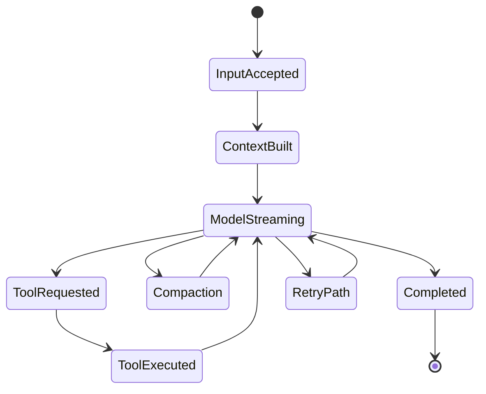
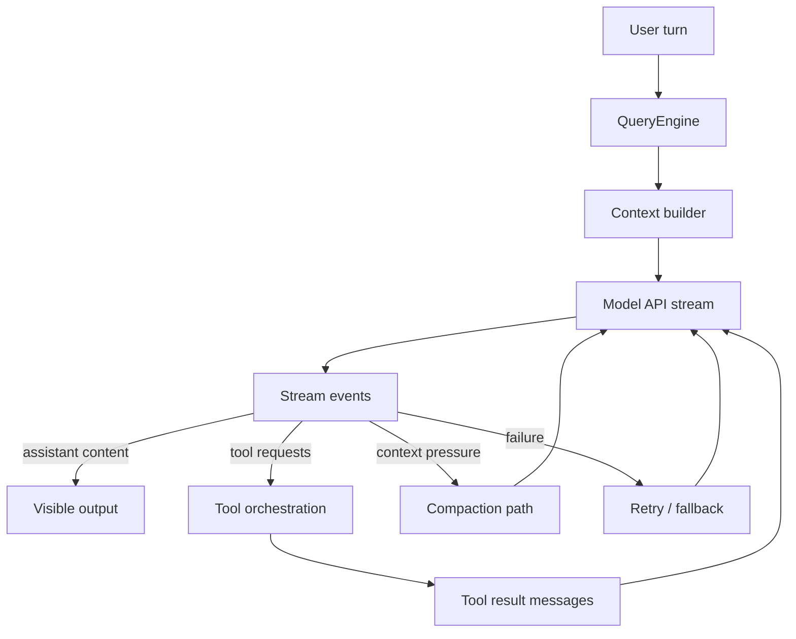

# Chapter 2 - Query Engine and Conversation Lifecycle

## Why this is the center of the system

The query engine is where Claude Code's main ideas converge:

- prompt construction
- model invocation
- tool-use orchestration
- streaming output
- retries and recovery
- context compaction
- transcript persistence

If the CLI is the control plane, this chapter covers the execution core.

## Core implementation surfaces

The main files are:

- `src/QueryEngine.ts`
- `src/query.ts`
- `src/utils/queryContext.ts`
- `src/services/api/claude.ts`
- `src/services/api/withRetry.ts`
- `src/services/compact/`

## Why the engine is split across `QueryEngine.ts` and `query.ts`

The split appears to separate two concerns:

- **conversation ownership** and turn-scoped state management
- **the lower-level query loop** that performs the repeated model/tool interaction cycle

This is a useful design because the runtime can keep one stable conversation object while still reusing or adapting the underlying loop for different interfaces such as REPL and SDK/headless execution.

## Conversation ownership

`QueryEngine` owns the state of a conversation across turns. It persists session-scoped artifacts such as:

- accumulated messages
- file read cache state
- permission denial history
- usage totals
- skill-discovery state
- abort control

This means a turn is not an isolated prompt/response pair. It is one iteration inside an ongoing runtime-managed conversation.

## What conversation ownership buys the runtime

Keeping conversation ownership in one place allows the system to preserve continuity across turns for concerns that would otherwise be scattered:

- file-read context and cache state
- cumulative usage and budget awareness
- mode- or skill-related memory
- replay and recovery semantics
- session-level error and permission history

This makes the engine much better suited for long-running sessions than a stateless request handler would be.

## Turn lifecycle

At a high level, a user turn looks like this:

The key observation is that one user turn can contain several internal loops before a final answer is reached.

## Turn phases in practice

| Phase | What the runtime is trying to accomplish |
| --- | --- |
| Accept and normalize input | turn raw user intent into a stable internal representation |
| Build context | assemble messages, system sections, tools, and dynamic state |
| Start model stream | request a response while preserving streaming semantics |
| Interpret events | distinguish text generation from tool requests and control events |
| Execute requested work | run tools, hooks, and permission checks |
| Recover if needed | compact, retry, or switch paths when constraints are hit |
| Finalize turn | persist results, usage, and final message state |

**Example:** a request like "run the tests, fix the failure, and explain the root cause" usually touches nearly every phase. The engine first normalizes the prompt, then assembles context, then streams a model response that may call a shell tool, then feeds the test result back into the same turn, then accepts an edit tool call, and finally emits a natural-language explanation once the loop stabilizes.

The important idea is that the turn model is operational rather than purely conversational.

## Loop-carried state inside the turn

The query loop is not re-deriving everything from scratch on each iteration. It carries forward mutable state that reflects how the turn has evolved so far, including:

- the current normalized message set
- tool-execution context and caches
- auto-compact tracking
- output-limit recovery counters
- pending summaries or stop-hook state
- the count of model/tool cycles already consumed in the current turn

This matters because retries, compaction, tool continuations, and stop conditions all depend on prior loop history. The engine is therefore better understood as a small workflow state machine than as a stateless request wrapper.

## Prompt and context assembly

The system prompt is assembled from several sources:

- stable base sections
- dynamic runtime sections
- feature- and mode-specific additions
- optional custom or appended prompts
- tool and MCP visibility information
- model-specific capability shaping

The architecture treats prompt composition as a cache-sensitive operation. Stable prompt sections are intentionally separated from dynamic ones so server-side or client-side caching remains useful.

## Context assembly as a negotiation

Building context is not simply concatenating old messages. The runtime has to negotiate among:

- what the model should still see
- what the user expects the session to remember
- what the tool surface currently is
- what the current mode or policy posture allows
- what the context window can actually hold

This is why context assembly and compaction are closely related rather than separate afterthoughts.

## Cacheability as an architectural concern

Claude Code treats prompt stability almost like an infrastructure feature. Tool ordering, system-prompt sectioning, feature headers, and some mode latches all exist partly to avoid unnecessary churn in the final request envelope.

This is unusual in normal application code, but it makes sense in a system where repeated prompt construction has direct latency and cost consequences.

## Streaming model

The model interaction layer is event-driven. Responses are not treated as one final blob; instead, the runtime receives a stream of structured events and turns those into internal session messages.

That matters for several reasons:

- partial assistant output can appear before the turn is complete
- usage and stop metadata may arrive late
- tool requests can interrupt ordinary text generation
- retries and fallback need to preserve conversational continuity

Another consequence is that the engine needs a message model rich enough to express intermediate states without losing the final semantic result of the turn.

## Query loop sketch

## Tool loops inside a turn

Claude Code treats tool use as a first-class continuation of the same turn. Once the model requests a tool:

1. the request is validated and checked
2. the tool is run or denied
3. the result is converted back into session/message form
4. the model is given the updated state and continues

This keeps tool usage inside the same conversational logic instead of treating it as an external side quest.

## Retries and fallback

Claude Code contains a layered recovery strategy rather than a single retry switch:

- transport retries for transient API failures
- backoff for rate or capacity issues
- fallback between streaming and non-streaming paths when appropriate
- model fallback in selected cases
- recovery paths when context grows too large or output limits are hit

This is one of the clearest examples of Claude Code optimizing for long-lived, real-world sessions instead of ideal-case demos.

Concrete fallback behaviors in the surrounding compact/retry machinery include:

- retrying streaming-related failures on a bounded basis
- reacting differently to prompt-too-long failures than to ordinary transport errors
- using circuit-breaker style limits so hopeless autocompact loops stop after repeated failure
- preserving a fallback path for manual or reactive compaction even when proactive autocompact is disabled

## Abort, budget, and bounded execution

Although the system supports long-lived sessions, each turn still needs bounded execution behavior. The engine therefore carries concepts such as:

- abort control
- maximum turn or tool-loop limits
- budget-related constraints
- fallbacks when a path becomes too expensive or too fragile

These boundaries keep the runtime from turning autonomy into unbounded drift.

## Headless versus interactive projection

The same underlying turn can be projected differently depending on who is consuming it:

- a human in the REPL wants readable streaming progress and transcript continuity
- an SDK or structured-output consumer wants normalized event objects and stable machine-readable boundaries

The query engine therefore acts partly as a translation layer between internal conversation mechanics and external consumption formats.

## Compaction and history shaping

Long-running sessions eventually collide with context limits. Claude Code responds with multiple history-shaping techniques rather than one generic summary step.

This chapter focuses on compaction as it behaves inside the active turn loop. Chapter 3 returns to the same subsystem from the perspective of memory, prompt assets, and long-lived context design.

The compaction family includes ideas such as:

- snipping or boundary-based trimming
- micro-compaction
- context collapse
- reactive compaction when a request fails

This separation suggests the team views context pressure as several distinct problems:

- excessive raw history
- media-heavy turns
- stale but still semantically relevant material
- request-specific token overflows

Concrete compaction mechanisms visible under `src/services/compact/` include:

- **full conversation compaction** via `compactConversation`, which summarizes older conversation into a compact boundary and then reconstructs a post-compact working set
- **auto-compact** via `autoCompactIfNeeded`, which watches token thresholds and triggers compaction before the session hard-fails on context limits
- **microcompact** via `microcompactMessages`, which clears or shrinks bulky tool results without requiring a full summary pass
- **API context management / API microcompact** via `apiMicrocompact.ts`, which asks the provider-side context-management layer to clear selected tool-use payloads or older thinking blocks
- **session-memory compaction** via `sessionMemoryCompact.ts`, which tries to preserve a bounded, semantically useful recent segment before falling back to heavier conversation compaction

## Why compaction is not just summarization

Claude Code treats compaction as a structured family of transformations, not simply as "ask the model to summarize earlier chat." Compact-boundary creation preserves a durable summarized breakpoint, microcompact removes bulky historical payloads while keeping the fact that tools ran, and reactive/manual compaction paths act as recovery mechanisms when the ordinary turn path runs out of space. This suggests the team values preserving execution semantics, not just reducing token count.

**Example:** if an earlier part of the session contains a failing test run, a file read, and a partially completed edit cycle, the compacted history still needs to preserve that those events happened in that order and with which roles. A plain prose summary like "the assistant debugged a test failure" would be too lossy, because later repair and resume logic may still care that a tool-result block existed and that the failure preceded the edit.

More concretely, different techniques preserve different things:

- **compact boundaries** preserve a durable marker that says "everything before this point has been collapsed into a summarized representation"
- **session-memory compaction** preserves a recent text-bearing segment plus API invariants such as matching `tool_use`/`tool_result` pairs and related streamed assistant fragments
- **microcompact** preserves the fact that a tool ran while replacing large historical payloads with cleared markers or reduced content
- **image/document stripping before compaction** preserves the semantic fact that media existed, but replaces it with textual markers like `[image]` or `[document]` so the summary pass does not spend context on raw media blocks
- **reinjected-attachment stripping** removes attachment types that will be restored after compaction anyway, preventing the summary from wasting tokens on stale discovery artifacts

So "preserve boundaries" in Claude Code means preserving session meaning and API correctness, not necessarily preserving every original byte.

The prompt-too-long recovery path is also concrete rather than abstract. `compact.ts` includes a last-resort retry strategy that drops the oldest API-round groups when the compact request itself becomes too large. That is intentionally lossy, but it still respects conversation grouping instead of deleting arbitrary individual messages.

Likewise, microcompact is not a single operation. In practice, it can include:

- clearing old shell/search/read/fetch-style tool result content
- clearing or excluding selected tool inputs/uses once input-token thresholds are crossed
- time-based clearing of old tool-result content
- clearing or retaining only recent thinking blocks depending on model/runtime policy

This is why compaction in Claude Code is better understood as **context management** than as mere summarization.

## Session messages as runtime artifacts

The query engine does not just manage prompts and completions. It also normalizes a wider set of message types:

- assistant content
- user turns
- tool results
- system markers
- compaction boundaries
- local command output

This gives the runtime a shared vocabulary across UI, persistence, and SDK-style output paths.

## Message semantics across layers

The same internal message stream has to satisfy several consumers:

- the model needs tool results and system boundaries
- the UI needs readable progress and transcript continuity
- persistence needs durable replay semantics
- SDK or remote consumers need stable event-like structure

The engine's message model is therefore one of the most important shared languages in Claude Code.

## The engine continuously repairs structural validity

The query engine is doing more than moving messages between components. It is constantly maintaining a conversation structure that remains valid for later provider submission, recovery, and replay.

That maintenance includes concerns such as:

- ensuring interrupted tool trajectories still produce usable `tool_result` continuations
- preserving the rules around thinking blocks and assistant-message grouping
- avoiding premature exposure of intermediate error states if an internal recovery loop is still active
- inserting synthetic control messages when continuity must be restored explicitly rather than inferred

This is one of the clearest ways in which Claude Code differs from a simple chat client. The engine is not only telling a story about what happened; it is preserving a structurally valid execution history that later subsystems can safely consume.

## Why the message model is broader than chat

Claude Code treats a session as an operational trace, not just as a conversation transcript. That is why it needs message forms for:

- tool lifecycle data
- local command output
- compaction boundaries
- synthetic control or recovery markers

This broader message vocabulary is what makes resume, structured output, and delegated work readable to both the user and the system.

## Important implementation details

### One visible turn may contain several hidden internal loops

A user experiences one answer, but internally the runtime may execute a sequence of model calls, tool calls, retries, and context reductions before completion.

This is a major reason the query engine is not a simple request/response wrapper. The turn boundary that matters to the user is broader than the call boundary that matters to the provider, tool system, or compaction machinery.

### Streaming output is provisional

The engine can display content before final metadata is known. Final stop reasons and usage data may only become available after later stream events.

That provisionality shapes the message model and UI. The system has to tolerate the fact that an assistant message may be partially visible now, enriched later with token usage or stop metadata, and followed by tool-related continuation rather than an ordinary final answer.

### Prompt shape is an optimization target

Prompt composition is not only about correctness. It is also designed to preserve cache stability and avoid needless variation in repeated sessions.

This explains why details such as system-prompt partitioning, stable tool ordering, feature-header latching, and selective context clearing appear in code that might otherwise look like ordinary orchestration logic. Prompt structure has direct performance consequences.

### Compaction is part of normal operation, not an emergency-only path

The presence of several compaction strategies indicates that long sessions are expected and intentionally supported.

The runtime treats compaction as part of healthy session maintenance, not as a rare failure path. Warning thresholds, autocompact thresholds, manual compact commands, and reactive compact fallbacks all point to an architecture that assumes sessions will eventually need active context management.

### Compaction code explicitly protects API invariants

The compaction subsystem is careful not to orphan `tool_result` blocks from their corresponding `tool_use` blocks or to split streamed assistant fragments that need to be merged later. This is one reason compaction requires dedicated logic instead of generic transcript truncation.

That protection is essential because the conversation is not just free text. The stored message graph has structural rules, and violating them can make later replay or provider submission invalid even if the transcript still "looks readable" to a human.

### The query engine is also an adapter layer

It is responsible not just for talking to the model, but for adapting between user-facing state, API-facing payloads, tool-facing execution, and persistence-facing message representations.

This adapter role is what lets one engine support both the human-facing REPL and machine-facing structured output paths. The core execution semantics can stay shared while the projection of those semantics changes by consumer.

### Continuity is more important than purity

Several design choices in the query engine favor keeping the session coherent across retries, stream interruptions, and context changes instead of maintaining a minimal or theoretically pure loop. This is a pragmatic architecture for real usage.

That tradeoff shows up repeatedly: the engine prefers preserving a usable session narrative over preserving a minimal implementation. For this product, continuity is part of correctness.

## Architectural takeaway

The query engine is best understood as a conversation workflow runtime. It continuously translates between human intent, model-visible context, tool side effects, and durable session state. Almost every other subsystem exists either to feed this loop or to constrain it safely.
