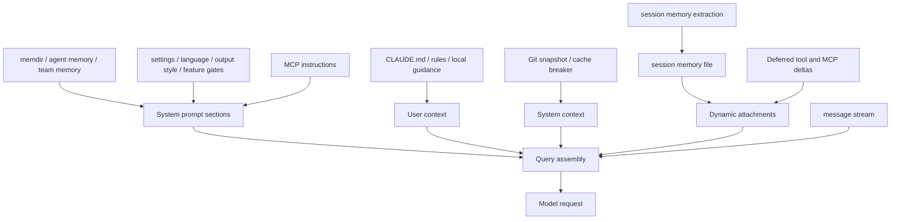

# Chapter 3 - Context, Memory, and Prompt Assets

## Why this chapter matters

The execution core only becomes useful once Claude Code decides **what the model should think with**.

Claude Code does not send the model a single monolithic prompt. It assembles a reasoning surface from several different kinds of material:

- static operating instructions
- dynamic environment and mode information
- repository and user guidance files
- persistent memory systems
- session-specific notes
- tool and integration descriptions
- message attachments that carry context outside the main system prompt

This subsystem is one of the clearest places where product behavior emerges from architecture. The assistant's quality depends not only on which tools exist, but also on **what context is loaded, how it is prioritized, how long it stays stable, and which parts are allowed to mutate between turns**.

## Core implementation surfaces

- `src/context.ts`
- `src/constants/prompts.ts`
- `src/constants/systemPromptSections.ts`
- `src/utils/systemPrompt.ts`
- `src/utils/claudemd.ts`
- `src/memdir/`
- `src/services/SessionMemory/`
- `src/utils/queryContext.ts`

## Context is assembled from several planes

One of the most important architectural facts is that "context" is not a single thing. The runtime splits it across several planes with different lifetimes and different cache behavior.

| Plane | Typical contents | Why it exists |
| --- | --- | --- |
| System prompt | operating instructions, tool guidance, memory prompt, mode sections | stable high-priority behavior shaping |
| User context | CLAUDE.md and related instruction files, date, user-oriented repository guidance | durable, repository-aware instruction material |
| System context | git snapshot, cache-break injection, environment facts | process-side facts that are useful but not user-authored |
| Message stream | user turns, tool results, attachments, compaction boundaries | turn-by-turn conversational and operational state |
| Persistent memory files | auto memory, session memory, agent memory, team memory | information that should outlive a single turn or session |

This layering is a direct response to competing goals. Some information should be highly stable for prompt caching. Some should update every turn. Some should be durable but not always inlined. Some should be recoverable only when needed. Claude Code uses different context planes so those requirements do not collapse into one brittle prompt string.

## System prompt versus user and system context

`context.ts` makes the split especially clear. The runtime computes both **system context** and **user context**, and those are separate from the system prompt itself.

That distinction matters because different context planes have different semantics:

- the **system prompt** tells the assistant how to behave
- the **user context** provides project- and user-specific guidance that should be treated as instructions
- the **system context** provides operational facts such as git state or cache-breaking markers

This avoids overloading any one prompt surface. Repository guidance like CLAUDE.md does not need to be hard-coded into the main prompt template, and volatile runtime facts do not have to be mixed indiscriminately with durable instruction text.

## A single request is an envelope, not one string

One useful way to visualize the request is as a layered envelope:

```text
[system prompt sections]
[system context appended as key: value lines]

<system-reminder>
# claudeMd
...
# currentDate
...
</system-reminder>

[ordinary conversation messages]
[tool schemas whose descriptions also contain instructions]
```

This architecture matters because each layer has different semantics. The system prompt is the most authoritative behavioral surface. The `<system-reminder>` wrapper carries user- or repository-specific instructions without forcing them into the static prompt prefix. Tool descriptions carry yet another instruction surface: what the model is allowed and expected to do with each capability it sees.

## Effective prompt selection is layered

`utils/systemPrompt.ts` shows that even the "system prompt" is not singular. The runtime chooses an effective prompt according to a priority ladder:

1. full override prompt, if one is explicitly provided
2. coordinator prompt when coordinator mode is active
3. agent-specific prompt when the main thread is acting as a custom or built-in agent
4. custom prompt from user-specified flags
5. the default Claude Code prompt

An appended system prompt can still be layered on top afterward.

This priority model is architecturally useful because it lets the product support different personalities without rewriting the rest of the query loop. The execution engine can remain the same while the instruction surface changes substantially.

## The priority ladder is simple enough to quote

A compact way to describe the selection logic is:

```text
override > coordinator > agent > custom > default
+ appendSystemPrompt unless a full override replaces the stack
```

That ordering is important because it explains why Claude Code can change identity without changing machinery. A coordinator run, a custom agent run, and an ordinary interactive run may all execute through the same core query loop, yet the top of the instruction stack can differ dramatically. The runtime therefore treats prompt selection as a first-class control-plane decision rather than as a late string substitution.

## Prompt authority is not execution authority

One of the most important distinctions in Claude Code is that prompt layering and runtime permission are related, but not identical.

| Layer | What it decides | Representative mechanism |
| --- | --- | --- |
| **Prompt identity** | who Claude Code is acting as | `override > coordinator > agent > custom > default` |
| **Repository and user guidance** | how Claude Code should behave for this codebase or user | `CLAUDE.md`, local instruction files, managed instructions |
| **Turn-scoped workflow guidance** | what this one request is trying to do | slash-command prompt text, `initialPrompt`, attachments |
| **Execution authority** | what actions may actually run | settings, policy-managed configuration, permission rules, sandboxing |

This means a repository instruction can absolutely override the **default assistant behavior** inside the reasoning surface, while still failing to override the runtime's execution boundary. A `CLAUDE.md` file can tell Claude Code to prefer Bash or to use a certain workflow, but it cannot force a blocked tool to run or bypass a sandbox restriction. Chapter 5 picks up that second axis.

## System prompt sections and cache discipline

`constants/systemPromptSections.ts` and `constants/prompts.ts` show that the default prompt is itself assembled from named sections rather than handwritten as one opaque blob.

This section model buys the runtime several things at once:

- memoization for sections that should stay stable over the session
- explicit marking of sections that are allowed to break cache stability
- clean separation between static prompt prefix and dynamic prompt suffix
- central control over when prompt-related caches should be cleared

The design is explicit about the tradeoff. Most sections are memoized and reused, but some sections are marked as dangerously uncached because they depend on truly volatile runtime state, such as late-changing MCP instructions. This is not just prompt engineering style; it is an operational contract about which parts of reasoning context are allowed to move.

## The default prompt is a registry, not a paragraph

`getSystemPrompt()` in `constants/prompts.ts` reads more like registry composition than like template rendering. It pulls together sections for:

- session-specific guidance
- memory
- environment information
- language and output style
- MCP instructions
- scratchpad instructions
- function-result-clearing policy
- summarize-tool-results guidance
- feature- or model-specific behavior

This makes the prompt layer behave like a subsystem with policies, caches, and feature gates. The system prompt is not "just words"; it is the model-facing projection of several runtime registries.

## Representative passages from the default prompt

Several short excerpts reveal what kind of operating manual the default prompt really is. Its opening identity frame begins:

```text
You are an interactive agent that helps users ...
IMPORTANT: You must NEVER generate or guess URLs for the user unless you are confident that the URLs are for helping the user with programming.
```

Its task posture is equally direct:

```text
# Doing tasks
- The user will primarily request you to perform software engineering tasks.
- In general, do not propose changes to code you haven't read.
- Do not create files unless they're absolutely necessary ...
```

Its caution model is not hidden inside the permission subsystem; it is stated plainly:

```text
# Executing actions with care

Carefully consider the reversibility and blast radius of actions...
```

And its tool strategy is part of the prompt, not merely part of implementation:

```text
# Using your tools
- Do NOT use the Bash tool to run commands when a relevant dedicated tool is provided.
- ... make all independent tool calls in parallel.
```

These passages are worth quoting because they show that the default prompt is not a generic assistant preamble. It is a compact operational handbook for how Claude Code should behave as a software-engineering agent: what work to do, how to handle risk, and how to think about its toolset.

## Cache control is part of context architecture

The provider-facing request layer adds another important dimension: not all context changes are equally expensive. Claude Code therefore treats cache control as part of prompt design rather than as an afterthought in the API client.

Several mechanisms matter here:

- an explicit dynamic boundary between more stable and more volatile prompt sections
- cache-control metadata that can be attached at the system-prompt or tool-schema level
- session-stable latches that prevent oscillating cache policy between turns
- cache-break detection and telemetry so the runtime can observe when prompt reuse is being lost

This makes the context subsystem partly economic. The goal is not only to give the model the right information, but also to do so in a way that preserves reuse across long engineering sessions.

## Output styles are prompt patches, not renderer themes

Built-in output styles enter the system prompt as ordinary instruction text. The Explanatory style, for example, adds a section that begins:

```text
# Output Style: Explanatory
You are an interactive CLI tool that helps users with software engineering tasks. In addition to software engineering tasks, you should provide educational insights about the codebase along the way.
```

It then adds an explicit `## Insights` convention that tells Claude Code to frame small educational notes in a recognizable block format. The Learning style goes further by instructing the model to request small human-written code contributions for certain kinds of work:

```text
## Requesting Human Contributions
In order to encourage learning, ask the human to contribute 2-10 line code pieces when generating 20+ lines involving:
- Design decisions
- Business logic with multiple valid approaches
- Key algorithms or interface definitions
```

This is architecturally significant because output style is not a post-processing theme. It changes the model's behavioral instructions directly. A different style means a genuinely different prompt, not merely a different renderer for the same underlying answer.

## Instruction files and repository guidance

`utils/claudemd.ts` is one of the most important files in Claude Code because it governs how checked-in and private guidance are loaded.

**Example:** a repository root might declare "use pnpm and never edit generated files," while a nested frontend rules file adds UI-specific guidance, and a local private instruction file adds a machine-specific reminder. When the user works inside that frontend subtree, Claude Code layers those sources instead of forcing all project guidance into one global document.

The loading model is explicit:

1. managed instructions
2. user-global instructions
3. project instructions
4. local private project instructions

Discovery is also path-aware. Project and local files are found by walking upward from the current directory, and files closer to the active working path win by being loaded later. That creates a layered instruction model where the assistant can inherit global rules while still respecting project- and subdirectory-specific guidance.

## External instructions are framed as overrides, then wrapped as context

Claude Code does not merely paste discovered instruction files into the request. It first gives them a strong framing paragraph:

```text
Codebase and user instructions are shown below. Be sure to adhere to these instructions. IMPORTANT: These instructions OVERRIDE any default behavior and you MUST follow them exactly as written.
```

Then the request layer wraps them in a meta user message that looks like this:

```xml
<system-reminder>
As you answer the user's questions, you can use the following context:
# claudeMd
...
# currentDate
...

IMPORTANT: this context may or may not be relevant to your tasks. You should not respond to this context unless it is highly relevant to your task.
</system-reminder>
```

This two-step framing is important, but it is easy to misread without one extra clarification. The override language is about **assistant behavior relative to the default prompt**, not about overriding managed policy, permission checks, tool visibility, or sandboxing. The wrapper also carries a mix of material: some of it is binding repository guidance, some of it is opportunistic context such as dates or environment facts. Claude Code is expected to obey the guidance when it applies, while still ignoring irrelevant contextual filler instead of talking about it gratuitously.

The second step keeps these materials out of the static base prompt, which helps preserve cache stability while still letting project-specific rules materially reshape behavior.

## `/init` is the authoring path for many of these prompt assets

Many of these instruction assets are created through `/init`, especially `CLAUDE.md`, `CLAUDE.local.md`, and related skill or hook scaffolding. The important point is architectural: Claude Code uses a prompt-driven workflow to generate future prompt-shaping artifacts instead of relying on a separate static scaffolder.

Chapter 6 covers the command path in detail. From the perspective of context design, `/init` matters because it closes the loop between live repository exploration and durable instruction material that later sessions will load as high-priority context.

## Includes and path scoping

The instruction layer is not limited to single files. `claudemd.ts` supports include-style references and frontmatter-based path scoping, which means repository guidance can be decomposed without losing automatic discovery.

This has two important architectural effects:

- instruction loading scales beyond one massive CLAUDE.md file
- the runtime can decide that some guidance only applies to certain file paths or subtrees

This is one of the reasons the instruction subsystem feels more like configuration resolution than like markdown loading. It has to parse, filter, and compose policy-bearing documents rather than merely display them.

## Context files are also safety-sensitive

Instruction loading is not a free-for-all. The code treats memory and instruction files as privileged material that can reshape how the agent behaves, so their discovery and inclusion rules are constrained.

Examples include:

- explicit filtering of injected memory files to avoid redundant reloading
- trusted-source checks for settings that can override memory directories
- path validation for auto-memory overrides so dangerous roots are rejected
- hooks around instruction loading so the runtime can observe or extend how guidance enters the session

This is another place where context and safety are intertwined. A memory or instruction file is not just content; it is executable influence over later model behavior.

## Memory is not one subsystem

Claude Code uses several different memory mechanisms, each with a different scope.

| Memory form | Main purpose | Typical lifetime |
| --- | --- | --- |
| CLAUDE.md / rules / local instructions | stable behavioral and project guidance | long-lived and mostly user-managed |
| Auto memory (`memdir/`) | persistent cross-session knowledge organized as files | long-lived and assistant-updated |
| Session memory | compact notes about the current session's evolving context | session-scoped but durable enough for compaction support |
| Agent memory | memory prompt material attached to a specific agent type | durable across uses of that agent |
| Team memory | shared memory surface for coordinated teammates | durable across team-based work |

The key idea is that these mechanisms solve different problems. Claude Code does not pretend that all persistence should go into one magical note file.

## Auto memory and `memdir`

The `memdir/` subsystem gives Claude Code a file-based memory system with its own rules, taxonomy, and entrypoint conventions. This is much more structured than simply telling the model to remember things.

Important features of this subsystem include:

- a canonical `MEMORY.md` entrypoint that acts as an index rather than a dump
- a closed memory taxonomy such as user, feedback, project, and reference
- rules about what should **not** be saved, especially information derivable from code or git state
- search guidance that teaches the agent how to look through topic files and, if necessary, historical transcripts
- path resolution that tries to unify worktrees of the same repository under one stable memory base

This design reveals an important architectural boundary: durable memory is treated as a managed filesystem, not just as hidden model state.

## The memory layer explains its own discipline

The memory subsystem does not rely on vague advice such as "remember useful things." It injects a concrete operating guide. A representative excerpt begins:

```text
# auto memory

You have a persistent, file-based memory system found at: `...`
```

and continues with explicit sections such as:

```text
## Types of memory
## What NOT to save in memory
## How to save memories
## When to access memories
```

This is a revealing design choice. Claude Code is not asked to improvise a philosophy of memory each turn. It is given a file-management discipline: what kinds of things belong in memory, what does not belong there, where the entrypoint index lives, and how detailed memories should be organized underneath that index.

## Memory indexing versus memory content

`memdir.ts` makes a subtle but important distinction between the **entrypoint index** and the actual memory files. `MEMORY.md` is intentionally treated as a navigation layer, while individual memory files hold the detailed content.

That split solves several problems:

- the always-loaded prompt surface can stay concise
- detailed memory can remain semantically organized by topic
- old or wrong memories can be updated or removed independently
- the assistant can search topic files when it needs depth instead of bloating every turn with the full archive

This is a good example of Claude Code trading naive convenience for long-term context hygiene.

## Assistant-mode memory differs from ordinary memory

`memdir.ts` also shows that assistant-oriented or long-lived modes do not always write memory the same way as ordinary sessions. In assistant mode, new memory may be appended to daily log files rather than directly maintaining the distilled `MEMORY.md` index, with a later process responsible for consolidation.

That design is a reminder that Claude Code treats memory as an evolving operational dataset. Different product modes may write to different memory representations while still reading from a shared distilled orientation layer.

## Session memory is about compaction support

The `services/SessionMemory/` subsystem solves a different problem from auto memory. Session memory is not primarily a repository knowledge base; it is a compact, evolving note file about the **current session's** meaningful progress.

Chapter 2 already showed compaction as a turn-time continuation path. Here the question is broader: how session memory fits into the context architecture that makes long-lived reasoning and compaction sustainable over time.

The architecture here is especially revealing:

- extraction is threshold-based rather than continuous
- the thresholds depend on both token growth and tool-call activity
- extraction waits for safe moments so tool trajectories are not broken
- the summarization work is delegated to an isolated forked agent
- the forked agent receives a tightly constrained permission surface so it may edit only the session-memory file

This is much more rigorous than "occasionally summarize the chat." The runtime is trying to maintain a compact operational memory without destabilizing the live turn.

## Session memory uses hook-driven maintenance

`sessionMemory.ts` registers session-memory extraction as a post-sampling hook, which means it participates in the turn lifecycle without being hard-coded into every query path.

That hook-driven design has several benefits:

- extraction can be gated or disabled independently
- the main turn can finish before memory maintenance runs
- memory updates can use isolated read-file caches and fork-safe prompt parameters
- the subsystem can share token-counting logic with auto-compaction instead of inventing its own notion of context pressure

In architectural terms, session memory is part of the maintenance layer around long-lived reasoning, not part of the visible turn contract.

## Maintenance prompts are specialized workers, not loose reminders

The session-memory updater receives a very different instruction surface from the ordinary coding loop. It is told, for example:

```text
IMPORTANT: This message and these instructions are NOT part of the actual user conversation...
Your ONLY task is to use the Edit tool to update the notes file, then stop.
...
IMPORTANT: Always update "Current State" to reflect the most recent work...
```

The memory-extraction subagent receives an even narrower brief:

```text
You are now acting as the memory extraction subagent. Analyze the most recent ~N messages above and use them to update your persistent memory systems.
...
You MUST only use content from the last ~N messages to update your persistent memories.
Do not waste any turns attempting to investigate or verify that content further...
```

These specialized prompts show that Claude Code treats memory maintenance as real operational work with its own contracts, not as an informal side effect of the main loop. The maintenance agents are given sharply bounded roles so they can update durable context without accidentally turning into general-purpose coding assistants.

## Attachments surface dynamic context without rewriting the whole prompt

Not every piece of context is baked into the system prompt. The query assembly path can also attach structured messages that carry context as explicit artifacts.

**Example:** if the agent opens a newly relevant rules file during a debugging session, the runtime can surface that file as a nested-memory attachment in the message stream. The model gets the new guidance for the current turn, but the stable prompt prefix does not have to be regenerated just because one extra memory file became relevant mid-session.

This matters for several kinds of dynamic material:

- nested memory attachments for newly surfaced CLAUDE.md or rules files
- relevant-memory attachments discovered from the memory directory
- delta-style attachments for changed agent listings, deferred tools, or MCP instructions
- changed-file and other environment-sensitive attachments that should not force a full prompt rebuild

This attachment strategy is one of the cleverest parts of the architecture. Instead of treating every dynamic change as a reason to regenerate the entire reasoning surface, the runtime can keep the main prompt more stable and add only the extra material that is newly relevant.

## Nested memory is surfaced with deduplication rules

When the agent reads certain guidance-bearing files, the runtime can surface them as nested memory attachments. That surfacing is not a naive append operation. The system tracks what has already been injected, filters duplicates, and avoids reintroducing files that were already loaded through other context paths.

That produces two benefits:

- the model can still see newly relevant guidance in the conversational stream
- the session avoids prompt bloat caused by repeatedly surfacing the same memory files

This is another example of Claude Code preferring explicit context plumbing over an undifferentiated prompt blob.

## Context flow



## Why context is broader than prompt assembly

It is tempting to reduce this subsystem to "how the prompt is built," but Claude Code is doing something richer. It is managing several kinds of remembered truth with different scopes:

- instruction truth
- environment truth
- conversational truth
- durable personal or project memory
- compacted session truth

The runtime has to decide where each kind of truth belongs. That routing decision is one of the hidden sources of product quality.

## Important implementation details

### Representative logic sketch

A simplified version of prompt assembly looks like this:

```ts
const defaultPrompt = [
  intro,
  taskRules,
  toolRules,
  SYSTEM_PROMPT_DYNAMIC_BOUNDARY,
  sessionGuidance,
  memoryPrompt,
  envInfo,
  outputStyle,
]

const effectivePrompt =
  overridePrompt ??
  coordinatorPrompt ??
  agentPrompt ??
  customPrompt ??
  defaultPrompt

const system = appendSystemContext(effectivePrompt, systemContext)
const messages = prependUserContext(history, userContext)
```

The important detail is not the exact array syntax; it is the separation of concerns. Claude Code chooses one effective prompt stack, appends operational system context to that stack, and injects user/project context as a separate meta message.

### Context is split deliberately across multiple channels

Claude Code does not pour every relevant fact into one giant system prompt. It uses system prompt sections, user context, system context, and message attachments because those channels have different caching, visibility, and durability properties.

### Instruction loading has real precedence semantics

Managed, user, project, and local instruction files are not merely concatenated in arbitrary order. They form a layered precedence model that gives the assistant stable global guidance while still allowing repository- and path-specific override behavior.

### Memoized prompt sections are part of performance architecture

Named system prompt sections and their caches exist so the reasoning surface stays stable across turns. The prompt layer is engineered to preserve cacheability, not just readability.

### Attachments let dynamic context travel separately from the stable prompt

Nested memories, relevant memories, tool deltas, and MCP deltas can be surfaced as structured attachments instead of being baked into the always-present prompt prefix. This keeps dynamic context available without forcing unnecessary prompt churn.

### Auto memory is a filesystem with rules, not hidden latent state

The memdir subsystem uses directories, entrypoints, topic files, search guidance, and explicit write rules. That makes durable memory inspectable and repairable in a way that implicit model memory would not be.

### Session memory is maintained by constrained delegation

Instead of letting the main loop mutate its own summary state ad hoc, the runtime spawns a narrowly constrained forked agent to update session memory. This isolates side effects and keeps the maintenance path close to the same execution discipline as the main product.

### Effective prompts are chosen through a priority ladder

Override prompts, coordinator prompts, agent prompts, custom prompts, and appended prompts coexist because the runtime needs several ways to reshape behavior without cloning the rest of the architecture.

## Architectural takeaway

Context in Claude Code is a managed architecture, not a bag of prompt text. The system explicitly separates instruction loading, prompt-section caching, durable memory, and session summarization so the agent can stay both informed and stable over long-running work. Without this subsystem, the query engine would have tools but far less reliable judgment about how to use them.
