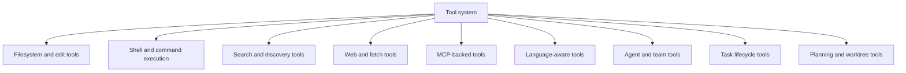
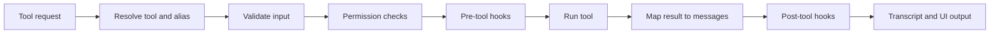

# Chapter 4 - Tool System and Execution Model

## Why tools matter so much

Claude Code is not built around text generation alone. It is built around **model-directed action**. The tool system is how the assistant moves from conversation into work.

That is why tool architecture occupies so much of Claude Code:

- tools define the assistant's capability surface
- permissions are evaluated around tools
- many product features are implemented as tools
- task, skill, and agent workflows reuse the same execution abstraction

## Core implementation surfaces

- `src/Tool.ts`
- `src/tools.ts`
- `src/tools/`
- `src/services/tools/toolOrchestration.ts`
- `src/services/tools/toolExecution.ts`

## The tool contract

`src/Tool.ts` defines a shared contract for all tools. A tool is more than a callable function. It typically includes:

- name and schema
- enablement checks
- input validation
- permission behavior
- execution logic
- progress events
- result mapping back into conversation messages
- rendering hints for the UI

This gives the runtime one common interface for very different capabilities.

## Anatomy of a tool definition

At a conceptual level, a tool definition answers four questions:

| Question | Typical answer in Claude Code |
| --- | --- |
| What is this capability called? | name, aliases, and user/model-visible identity |
| What does it accept and return? | schemas, validation, and result mapping |
| Under what conditions may it run? | enablement checks, permission behavior, safety posture |
| How should the runtime present it? | progress rendering, grouped output, message conversion |

This is why tools are such dense abstractions. They do not just encode action; they also encode how action participates in the larger session model.

## Why schemas matter so much

Schemas are not just for input validation. In this architecture they also serve as:

- part of the model-visible capability description
- a guardrail for execution correctness
- a normalization mechanism for tool output
- a bridge between UI rendering and machine-readable results

That makes the schema layer one of the important meeting points between model reasoning and runtime enforcement.

## Tool categories

The important point is not the list itself, but the unification: the model can reason about diverse operations through one execution grammar.

Representative tool families show how broad this grammar is:

- shell execution through Bash and PowerShell tools
- content access through file-read, file-edit, file-write, glob, and grep tools
- web and external information access through fetch and search tools
- delegated execution through Agent and Skill tools
- durable background control through task create/get/list/update/output/stop tools
- runtime state control through plan-mode and worktree entry/exit tools

## Tool registry and composition

`src/tools.ts` acts as the tool inventory and composition layer. It:

- enumerates built-in tools
- filters tools by feature and environment
- merges additional tool sources such as MCP
- applies deny rules and visibility constraints
- constructs the effective tool pool for the current runtime

This is one of the points where configuration, policy, and product shape directly alter model capability.

## Tool context is a runtime service bundle

When a tool runs, it receives far more than user-supplied arguments. The tool context acts like a bundle of runtime services and session-scoped state. Depending on the tool and mode, that context can include:

- the current command and tool inventories
- app-state accessors and task-aware state updaters
- MCP client and resource connections
- file-state caches and nested-memory tracking
- permission context and abort control
- notification, elicitation, and UI-update hooks
- session, agent, and conversation identifiers

This is a strong hint about the architecture. A tool is not an isolated helper function. It is a participant in a living session, with access to the infrastructure needed to coordinate with the rest of the runtime.

The benefit of this design is that higher-level features can still be expressed as tools without becoming second-class citizens. A task tool, agent tool, or MCP-backed tool can operate with the same broad runtime awareness as a local file-edit tool, even though their side effects are very different.

## Built-in tools versus discovered tools

Claude Code uses the same conceptual tool system for two different sourcing patterns:

- **built-in tools**, which ship with the binary and represent core capability
- **discovered or attached tools**, such as MCP-backed tools, whose availability depends on runtime context

This is important because it means the tool layer is both an execution abstraction and a dynamic inventory system.

In practice, this distinction changes startup and prompt behavior:

- built-in tools can be statically registered and feature-gated at build/runtime boundaries
- discovered tools, especially MCP-backed ones, depend on server configuration, connection state, and policy filtering before they become part of the effective capability set

## The effective tool pool is a policy artifact

The runtime does not simply "load all tools." It computes the effective tool pool from several inputs:

- built-in inventory
- feature availability
- environment constraints
- MCP-discovered tools
- deny and allow rules
- mode-specific restrictions

This means the final capability surface is a negotiated result, not a static list.

## Invocation lifecycle

Tool execution is a pipeline:

**Example:** when the model asks to run tests, the runtime does not jump straight into a shell. It resolves the tool, validates the arguments, checks whether the current mode allows that request, runs any pre-tool hooks, executes the command, and then maps the output back into transcript artifacts that both the user and the model can understand on the next loop.

This pipeline reveals an important design choice: tools produce conversation artifacts, not just return values.

That lifecycle also tends to include concrete substeps such as:

- schema validation and normalization of input
- resolution of tool aliases or alternate names
- permission-mode-aware approval checks
- pre-tool hook execution
- progress streaming while the tool is active
- post-tool result shaping into tool-result blocks, attachments, or system messages

## Permissions are part of invocation, not prelude

Permission checks are embedded in the invocation pipeline because they depend on the exact tool request, current runtime mode, and effective context. The architecture does not assume a separate prevalidated world where execution can run without further safety logic.

## Concurrency and orchestration

Some tools can safely run concurrently and some cannot. The contract reflects this, and orchestration logic uses those hints to decide whether multiple requests can proceed in parallel.

This is an important performance and correctness boundary. A read-only search tool and a mutating file-edit tool should not be treated the same way by a workflow engine.

## Tool orchestration as scheduling

Once multiple tool requests appear in a turn, the runtime has to behave partly like a scheduler:

- identify which requests can run concurrently
- preserve ordering where side effects matter
- stream results back into the conversation coherently
- ensure permission and hook semantics still hold

This is another reason the tool layer is more than a set of utility functions.

## Deferred and dynamic tools

Some tools affect the prompt and cache shape enough that the runtime benefits from delaying or filtering how they are exposed. This is one reason the tool system is tightly connected to prompt construction rather than being a purely post-model execution layer.

This is especially relevant for:

- attached external tools whose availability may change mid-session
- search or dynamic-discovery tooling that can alter the visible capability surface
- heavy integrations whose exposure may be filtered for cache stability or policy reasons

## Result mapping and progress

A tool call may produce several forms of output:

- progress updates
- a final result payload
- structured attachments or blocks
- synthetic system messages
- notifications for background or deferred work

That makes the tool system a messaging subsystem as much as an execution subsystem.

## Tool failure is translated, not just thrown

The runtime does not treat tool errors as raw implementation accidents bubbling up to the user. Failures are classified, sanitized, traced, and mapped into conversation-appropriate results.

Architecturally, that translation layer has to satisfy several audiences at once:

- the user needs an understandable explanation of what failed
- the model needs a result shape it can reason about in the next loop
- telemetry and tracing need stable, safe error categories
- permission and hook systems need a chance to react to denials or failures

This is why the tool-execution path contains logic for telemetry-safe error classification, permission-denied hooks, tracing spans, and result-block processing rather than simply allowing exceptions to escape. A tool failure is part of the session narrative and the operational record, not just a stack trace.

## Why result mapping is architecturally important

Result mapping is where the runtime translates from "a tool completed" into "the session now has a new meaningful artifact." That artifact may need to be:

- understandable to the user
- consumable by the model in the next loop
- durable enough for persistence or replay
- structured enough for machine-facing paths

This translation step is what lets tools participate naturally in the conversation model.

## Tools as the base for higher-level concepts

Several major product features are "tools in different clothes":

**Example:** a background task, a subagent launch, and a file read feel unrelated at the UI level, but the runtime still models each as a tool-shaped action surface. That common shape is what lets the query engine schedule them, permission-check them, serialize their outputs, and fold them back into one conversation model.

### Agents

Agent tools delegate work to subordinate execution contexts. This allows the system to spawn specialized workers without inventing a second execution model.

This chapter focuses on the shared tool contract that makes those launches possible. The coordinator/team topology that sits on top of agent tools is covered separately in Chapter 10.

### Skills

Skills are reusable prompt-driven capabilities, but they are still integrated into the tool model so they participate in discovery, invocation, and safety machinery.

### Tasks

Task tools turn background work into durable, queryable units. They extend the tool system from immediate execution into lifecycle-managed asynchronous work.

### Plan and worktree controls

Mode transitions and worktree-isolation features also appear as tools, reinforcing that "tool" means "runtime action surface," not just "API function."

## Why higher-level features are implemented as tools

Reusing the tool abstraction for agents, skills, tasks, and plan/worktree controls brings several benefits:

- one permission and safety model
- one place for result and progress handling
- one capability language visible to the model
- one execution grammar that works across local and external features

Without this reuse, Claude Code would likely fragment into several incompatible action systems.

## Comparing the higher-level tool forms

| Form | What it adds on top of the base tool model |
| --- | --- |
| Agent tool | delegated execution context and separate capability scope |
| Skill tool | reusable operational knowledge packaged for invocation |
| Task tools | durability, polling, lifecycle management, and background visibility |
| Plan/worktree tools | explicit runtime state transitions rather than ordinary file or shell work |

## Important implementation details

### Tool defaults are centralized

The tool builder logic provides consistent defaults so new tools do not need to re-implement core safety and lifecycle behavior.

This matters because a tool definition in Claude Code is expected to participate in many runtime concerns at once:

- validation
- enablement
- permissions
- progress reporting
- result mapping
- UI rendering

If every tool had to make all of those decisions from scratch, the system would quickly become inconsistent. Centralized defaults reduce that drift by ensuring that new tools begin with the same baseline expectations around safety, invocation, and output shaping.

It also means the tool system can evolve without rewriting every individual tool. When the runtime gains a better default for permission posture, progress handling, or result formatting, those improvements can be inherited by tools that rely on the common builder behavior.

### Tool visibility affects prompt shape

Whether a tool is enabled or deferred changes what the model is told it can do, so the registry has both runtime and prompt-construction significance.

This is more important than it sounds. In this architecture, the tool list is part of the model's working environment. If a tool is present in the effective pool, the model may plan around it, request it, and rely on its schema. If it is absent, deferred, or filtered, the model must reason differently.

That means the tool registry influences:

- the capability surface visible to the model
- prompt-cache stability, because tool ordering and inclusion affect the request envelope
- mode-specific behavior, because some environments should expose fewer actions
- policy behavior, because denied or disallowed tools should disappear before the model starts planning around them

So tool visibility is not a late execution concern. It is part of how the conversation is framed in the first place.

### Not all tool outputs deserve durable full fidelity

The surrounding runtime can later compact or clear old tool outputs while preserving the fact that the tool ran. This is why tool-result mapping and compaction are closely related parts of the architecture.

This is especially important for tools that can emit large payloads, such as:

- shell output
- file reads
- search results
- fetched web content

Those outputs may be useful in the short term but too expensive to keep in full forever. The architecture therefore distinguishes between:

- the **historical fact** that a tool was invoked
- the **semantic result** needed for later reasoning
- the **raw payload**, which may eventually be reduced, cleared, or replaced with a stub

That distinction allows the session to remain coherent without forcing the runtime to preserve every byte of prior output. It is one of the main reasons tool-result formatting and context-compaction logic are so tightly linked.

### Execution is hookable

Pre- and post-tool hooks allow the runtime to add policy, logging, or adaptation layers without rewriting each tool individually.

This gives the runtime an interception layer around action. Instead of baking every policy or telemetry concern into each tool, the system can surround tool execution with reusable behaviors such as:

- extra validation
- auditing and logging
- policy enforcement
- notification or attachment generation
- output adaptation for specific environments

Architecturally, this makes the tool layer extensible without making each tool implementation bloated. A tool can focus on its core capability while the runtime adds cross-cutting behavior around it.

It also helps keep product evolution manageable. New operational or safety requirements can often be introduced at the hook layer instead of by revisiting dozens of individual tools.

### Tool results become part of the conversation

This is why the tool system integrates so tightly with the query engine and session storage. Tool output must be captured in a form the model and user can both reason about.

That requirement changes the design of the tool layer substantially. A tool result cannot be treated as an internal return value only. It has to become a conversation artifact that can serve several audiences at once:

- the model, which may need the result for the next step in the turn
- the user, who needs to understand what just happened
- the persistence layer, which may need to replay or recover the session later
- machine-facing consumers, which may need structured output

This is why the runtime spends so much effort on mapping raw tool completion into blocks, messages, attachments, and progress records. The end result is that a tool call becomes part of the session's narrative, not just a side effect hidden behind the scenes.

### The tool layer is where product ideas become executable

Many features that users perceive as product workflows eventually resolve into tool invocations or tool-mediated state changes. That makes the tool system the most concrete expression of product capability in Claude Code.

This is one of the strongest reasons to study tools when trying to understand the product. Features that seem very different at the UX level often converge here:

- file editing
- code search
- web access
- delegation to agents
- task creation and retrieval
- plan or worktree transitions

At the product level these feel like different workflows. At the runtime level they are unified as tool-mediated capability. That makes the tool layer the place where product concepts stop being abstract and start becoming executable behavior.

It also means that changes to the tool system often have broad product impact. Adjusting tool visibility, validation, permissions, or result semantics can affect many top-level user experiences at once.

### Tool design balances model legibility and runtime rigor

Every tool has to be understandable enough for the model to invoke correctly while still being strict enough for the runtime to execute safely. That tension explains why tool definitions combine human-facing semantics, machine-facing schemas, and operational constraints in one place.

If a tool is too vague, the model may misuse it, call it with poor arguments, or plan around it incorrectly. If it is too loose, the runtime loses important safeguards around validation, permissions, and deterministic handling. The design therefore has to satisfy two very different consumers:

- the model, which needs clear names, schemas, and capability hints
- the runtime, which needs strict contracts, predictable result types, and enforceable safety constraints

That is why tool definitions in Claude Code often feel dense. They are simultaneously:

- documentation for the model
- contracts for the runtime
- guardrails for safe execution
- rendering metadata for the UI

This balance is one of the most distinctive qualities of Claude Code's architecture. A tool is not just a function. It is a carefully shaped interface between language-model reasoning and real-world action.

## Architectural takeaway

The tool system is the assistant's execution kernel. It turns language-model intent into controlled, inspectable, and often durable action. Understanding Claude Code without understanding the tool contract would miss the main mechanism that makes Claude Code more than a chatbot in a terminal.
