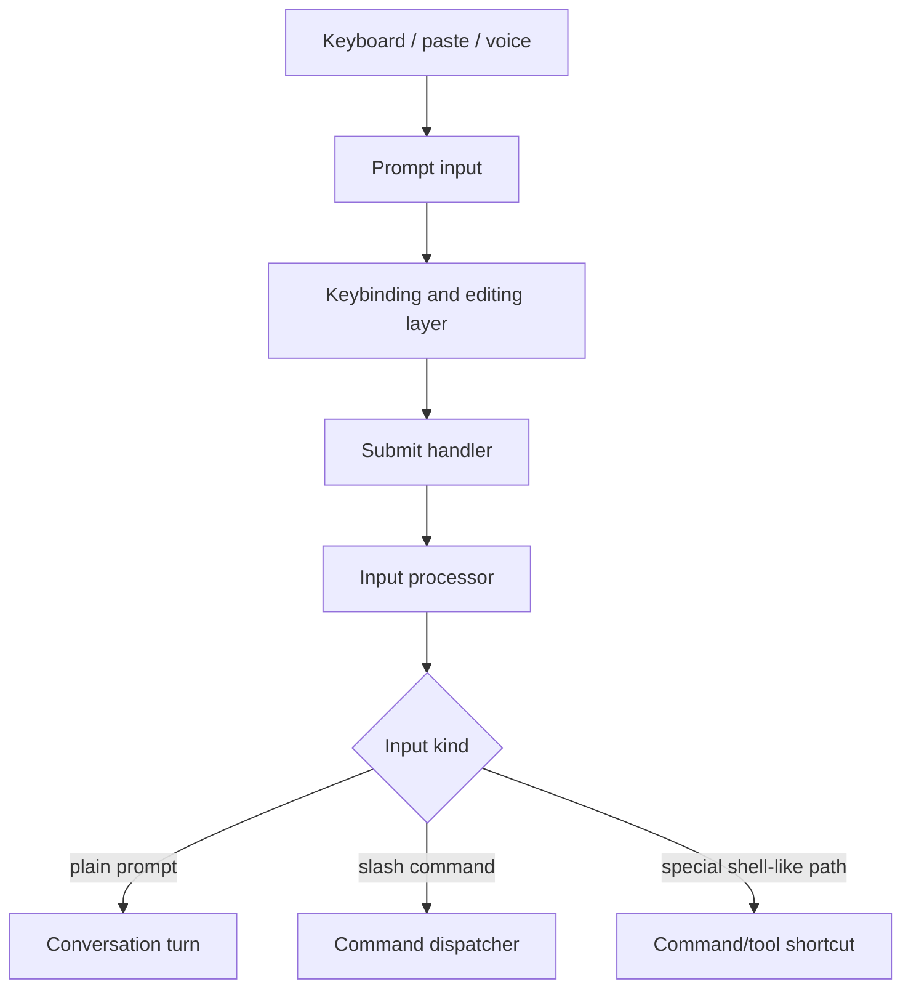
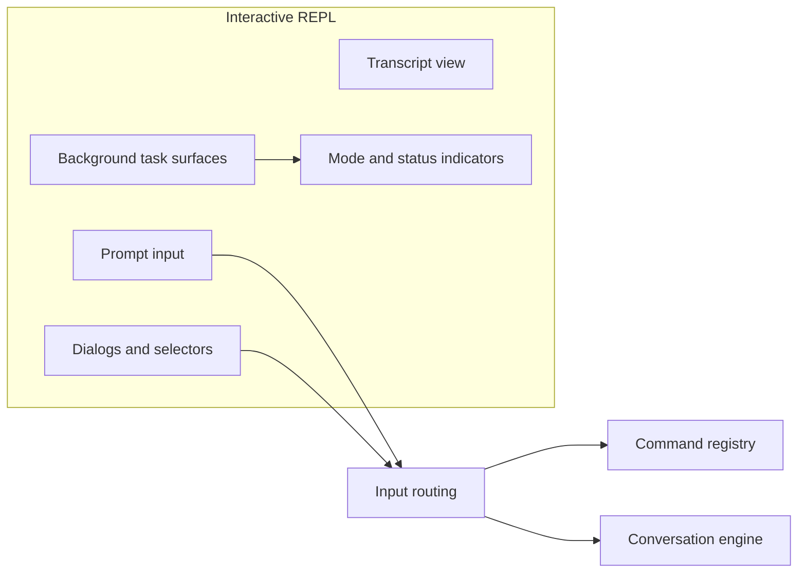

# Chapter 6 - Interaction Model and CLI Surface

## The user-facing surface is layered

Claude Code presents itself as a terminal experience, but the interaction model is richer than a plain command prompt. User intent can arrive through:

- freeform prompt text
- slash commands
- keybindings
- dialogs and selectors
- voice input
- external control messages in machine-driven modes

The interaction layer therefore acts as a routing and interpretation system, not just a text box.

It also reads best alongside Chapter 7, which explains how Claude Code chooses the runtime posture that assembles these surfaces in the first place.

## Core implementation surfaces

The key surfaces are:

- `src/commands.ts` and `src/commands/`
- `src/screens/`
- `src/components/`
- `src/hooks/`
- `src/keybindings/`
- `src/utils/processUserInput/`

Together, these define what users can ask for and how that request is transformed before it reaches the query engine.

## Why the CLI surface is architecturally important

In some systems, the user interface is mostly a thin skin over the core engine. Here, the CLI surface does more:

- classifies intent before execution
- reveals or hides workflow affordances
- provides safety checkpoints
- keeps long-running work understandable
- translates between human expectations and runtime abstractions such as commands, sessions, tasks, and tools

This is why so much code lives in UI- and input-adjacent directories.

## Command model

Slash commands form a major control surface. They are not all alike:

- some are local actions
- some generate prompts for the model
- some open dialogs or toggle UI state
- some are dynamically supplied by plugins or skills

This command registry is one of the bridges between user ergonomics and system capability. It exposes higher-level workflows such as review, settings management, session resume, MCP management, permissions, tasks, and summary/reporting flows.

## Command taxonomy

It is helpful to think of commands as falling into a few architectural buckets:

- **local control commands** that modify the runtime or UI directly
- **prompt-generating commands** that package work for the model
- **integration commands** that manage systems such as MCP, plugins, or remote sessions
- **inspection commands** that surface session, cost, context, or diagnostics state

This matters because the command registry is not simply a help menu. It is a formal map of what kinds of work the runtime can initiate.

Concrete examples of these buckets include:

- **local control**: commands that toggle modes, open selectors, or inspect local state
- **prompt-generating**: commands like review- or summary-style flows that package work for the model
- **integration**: commands for MCP, plugins, bridge/remote, auth, or environment management
- **inspection**: commands for context, cost, status, tasks, and session state

## `/init` is a prompt-driven workflow, not a hard-coded generator

One of the clearest examples of Claude Code's command philosophy is `/init`. At first glance, it looks like a conventional CLI bootstrap command that would procedurally generate files. Its implementation is more interesting than that.

`/init` is registered in `src/commands.ts` as a **prompt command**, not as a local imperative command. That means the command does not primarily execute a fixed TypeScript workflow. Instead, `src/commands/init.ts` contributes a model-facing workflow prompt, and the normal query engine carries the rest.

The new implementation begins with:

```text
Set up a minimal CLAUDE.md (and optionally skills and hooks) for this repo.
```

and then lays out an explicit multi-phase process:

```text
## Phase 1: Ask what to set up
## Phase 2: Explore the codebase
## Phase 3: Fill in the gaps
## Phase 4: Write CLAUDE.md
## Phase 5: Write CLAUDE.local.md
## Phase 6: Suggest and create skills
## Phase 7: Suggest additional optimizations
## Phase 8: Summary and next steps
```

This is an important architectural clue. Claude Code implements `/init` mostly as a **workflow specification** written in prompt text. The command tells the model which tools to use, in what order, what questions to ask, and what artifacts to create. The runtime itself contributes only a thin shell around that process.

## What the runtime does versus what the prompt does

The TypeScript side of `/init` is intentionally small. It does three main things:

1. registers the slash command and its description  
2. marks project onboarding as complete when the command is invoked  
3. chooses between the older simple prompt and the newer multi-phase prompt behind a feature gate

The rest of the behavior lives in the prompt. That prompt instructs Claude Code to use existing mechanisms such as:

- `AskUserQuestion` for setup choices and gap-filling interviews
- subagents for repo survey work
- ordinary read/search/edit/write tools to inspect the repository and create files
- the `Skill` tool when hook setup needs the hook-construction reference flow

This division of labor is revealing. `/init` is not a separate product subsystem with its own scaffolding engine. It is a curated orchestration layer built on top of the same command, tool, and prompt machinery used elsewhere in Claude Code.

## `/init` flows through the ordinary slash-command pipeline

`processSlashCommand.tsx` sends `/init` through the standard prompt-command path rather than a bespoke initializer path. The command's `getPromptForCommand()` result is wrapped into hidden model-visible messages, accompanied by command metadata, attachment extraction, and any tool-permission hints the command grants.

That means `/init` is architecturally closer to a specialized prompt package than to a traditional shell subcommand. The user sees a simple slash command, but internally Claude Code is injecting a carefully prepared operating brief into the conversation and then letting the ordinary query engine execute it.

## Why `/init` matters architecturally

`/init` is valuable not only because it creates files, but because it shows how Claude Code prefers to build complex workflows:

- keep the runtime primitive set small
- express higher-level workflows as prompt-driven coordination over those primitives
- reuse the same question-asking, delegation, and file-writing infrastructure
- turn onboarding into durable context by materializing `CLAUDE.md`, `CLAUDE.local.md`, skills, and hooks

In that sense, `/init` is a miniature of Claude Code itself. The command does not escape the architecture; it demonstrates it.

## Input routing pipeline



**Example:** `/clear` should run as a local command, while "clear the cache and explain what changed" should become a normal model-facing request, and a prompt with file references may collect attachments before send time. The same text box therefore feeds several different execution paths depending on how the input processor classifies the submission.

The important idea is that submitted input is categorized before it becomes a model turn. That lets the CLI offer specialized behavior without forcing every action through the same path.

## The submit order is more precise than the diagram suggests

The real submission path is not "parse commands, then maybe add some extras." Its ordering is more specific:

1. normalize pasted and inline image blocks
2. apply bridge-origin rules for remotely sourced `/...` input
3. rewrite ultraplan-style keyword prompts before ordinary dispatch
4. load attachments for paths that are staying on the ordinary prompt path
5. route explicit bash-mode input
6. route real slash commands
7. fall back to a regular prompt turn
8. run `UserPromptSubmit` hooks only if the base path still intends to query

That last point matters. Submit hooks are powerful, but they are not the first thing that touches every keystroke. They run after the base path has already decided that the input should become a query-producing turn.

## Prompt lifecycle

Even before submission, prompt text moves through several stages:

1. collection from keyboard, paste, or voice
2. editing and transformation by input helpers
3. optional interpretation as a command or special input form
4. submission-time normalization
5. routing into either local behavior or the query engine

This lifecycle is why prompt input code has to know about much more than string editing.

In practice, submission-time processing can also involve:

- slash-command parsing
- pasted-content expansion
- IDE selection attachment
- image validation, resizing, or storage
- keyword-triggered rewrites such as ultraplan handling
- hook execution that may block or enrich the prompt

This makes the prompt lifecycle a coordination point between UX, policy, and execution. It also explains why one generic phrase like "submit-time hooks" can be misleading: some transformations happen before slash-command routing, while `UserPromptSubmit` hooks run only after the base input path has decided to continue into query execution.

## Submission-time enrichment

One reason the interaction layer is more complex than it first appears is that submission is a transformation step, not just a handoff. Before a turn is allowed to enter the query engine, the runtime may:

**Example:** a user might type "fix this test failure" while an editor selection is active and a recent paste contains stack-trace text. By the time the query engine receives the request, the runtime may already have attached the selection, expanded the pasted content, run submit-time hooks, and rewritten parts of the prompt into a richer request envelope than the raw text alone.

- parse slash commands or intentionally skip them for remotely sourced messages
- expand pasted-content placeholders into explicit attachments or text blocks
- attach current IDE selection or other session-aware context
- validate, resize, store, or annotate pasted images
- rewrite prompt text when keywords imply a different higher-level workflow
- run submit-time hooks that can block, enrich, or redirect the request

This is an important architectural boundary. The input box collects what the user typed, but the submit pipeline decides what the runtime should mean by it.

It also explains why system-generated prompts and bridge-origin prompts receive special handling. Some messages should be visible to the user as ordinary typed input, while others should remain model-visible but user-hidden, or should be prevented from triggering local slash-command semantics on the wrong machine.

## REPL and TUI composition

The interactive experience is built with Ink, a React-based framework for terminal UIs, and organized around screen-level composition. The REPL screen coordinates:

- transcript rendering
- prompt input
- task indicators
- permission dialogs
- overlays and selectors
- optional voice and alternate input modes

The result is closer to a terminal application with internal state machines than to a simple "print lines and wait for input" shell.

## The REPL as an operating console

The REPL should be thought of as an operating console for a session, not just as an input box plus transcript. It combines:

- control inputs
- execution visibility
- approval workflows
- navigation and inspection
- background task awareness

This makes it a durable command center for ongoing work rather than a disposable chat window.

## Interaction-state boundaries

The REPL is not one monolithic loop. It is a composition of smaller interaction states:

- prompt editing state
- transcript navigation state
- modal approval state
- selector or chooser state
- background-task awareness state

This matters because each state changes what input means and what the user is allowed to do next.

## Keybinding-driven behavior

Keyboard handling is context-sensitive. The same keys may mean different things depending on whether the user is:

- editing a prompt
- navigating transcript mode
- responding to a dialog
- interacting with a selector or auxiliary surface

This matters architecturally because it means input handling is distributed across prompt editing, global shortcuts, and modal overlays.

Claude Code treats command-driven and keybinding-driven interaction as complementary. Some actions are better expressed as typed commands because they carry arguments or produce prompts; others are better as keybindings because they are modal, navigational, or immediate.

## Why keybindings matter beyond ergonomics

Keybindings are part of the product model because they enable transitions among states and surfaces faster than textual commands can. They effectively act as a second control channel alongside slash commands, especially for:

- navigation
- mode switching
- approval flow handling
- transcript management

This is one reason keybindings are treated as a subsystem instead of a bag of shortcuts.

## Prompt input as a subsystem

Prompt input is not a raw buffer. It participates in:

- command history
- typeahead and completions
- alternate editing modes such as Vim-style behavior
- voice insertion
- draft handling and buffer transformations

That makes the input surface one of the core coordination points between UX and runtime behavior.

## Editing modes and input continuity

The existence of alternate editing modes such as Vim-style behavior, plus voice insertion and draft handling, shows that the input subsystem is designed around continuity of user intent. The system tries to preserve what the user meant to say even as the surrounding runtime state changes.

## Local action versus model action

One of the cleanest UX design decisions in Claude Code is that not every user action becomes a model request. Some requests are better handled locally:

- opening a chooser
- switching a mode
- managing configuration
- navigating session history

This reduces unnecessary model calls and helps the user interface feel responsive and intentional.

This distinction also protects the model loop from being overloaded with UI concerns. The engine only sees work that genuinely belongs in the conversation or tool system.

## Permissions and background work in the UX

The user interface owns several operational responsibilities that a normal terminal app might delegate elsewhere:

- presenting permission requests
- reflecting background tasks
- surfacing state transitions like plan mode exits
- showing mode and environment warnings

In other words, the UX is also the user-facing safety and observability layer.

## UX for long-running sessions

The interface is built for sessions that may live longer than one prompt/response exchange. That affects design choices such as:

- visible task surfaces
- resumable state hints
- ongoing mode indicators
- warning banners and notices
- transcript navigation separate from prompt entry

The UI therefore carries continuity responsibilities, not just immediate feedback responsibilities.

## UI composition sketch



## Dynamic commands and extensibility

Not all commands are static. The interaction surface can be extended by:

- bundled skills
- plugin-provided commands
- dynamically discovered skill directories
- environment- or feature-gated command branches

This is important because the command system is both a UX layer and an extension layer.

## Command discovery as runtime composition

Because command availability can depend on bundled features, plugins, skills, or runtime posture, the command surface is partially composed at startup and during session life. This makes "what the user can do right now" a dynamic property of the session rather than a fixed product constant.

That dynamic composition is visible in `src/commands.ts`, which mixes always-available commands, feature-gated branches, and later-loaded plugin/skill contributions into one effective registry. Startup assembles the first usable snapshot of that registry, but later auth changes, plugin reloads, skill discovery, and cache invalidation can force it to be recomputed during session life.

## Why command loading stays lazy

The command registry cannot be built as one frozen constant at module-load time. Some commands depend on settings, feature gates, user type, plugin state, skill discovery, or even the cost of importing a very large module.

That is why the command layer uses a mix of strategies:

- feature-gated conditional imports so product-specific commands disappear from some builds
- memoized registry construction so config-dependent commands are assembled only when the runtime is ready
- lazy shims for especially heavy commands so the startup path does not pay their cost unless the user actually invokes them
- cache-clearing helpers for plugin and skill command sources so the surface can be refreshed when the extension world changes

This is another place where Claude Code behaves more like a platform than like a fixed CLI. The command surface is a runtime-composed inventory, and startup performance depends on treating it that way.

## Why the UI remains coupled to runtime state

The interaction layer is tightly coupled to application state for good reason. It must reflect:

- current permission posture
- available commands and tools
- active tasks and remote status
- current editing mode and prompt state
- session-specific warnings or notices

That coupling is not accidental complexity; it is what lets the CLI behave like an operational cockpit rather than a bare shell.

## Important implementation details

### Representative logic sketch

A simplified input-routing path looks like this:

```ts
const parsed = parseSlashCommand(input)

if (!parsed) return submitConversationTurn(input)

const command = getCommand(parsed.name)

switch (command.type) {
  case 'local':
    return runLocalCommand(command, parsed.args)
  case 'local-jsx':
    return openOverlay(command, parsed.args)
  case 'prompt':
    return getMessagesForPromptSlashCommand(command, parsed.args, ctx)
}
```

This is the key interaction trick in miniature. Claude Code does not treat every submitted string as ordinary conversation; it routes the same prompt box into local behavior, modal UI, or model-facing prompt generation depending on what the input processor decides.

### The submit handler is a policy point

Before the system sends anything to the model, it can expand attachments, process queued actions, short-circuit local commands, or redirect the request into another path.

The `processUserInput` path also shows concrete responsibilities such as:

- honoring bridge-origin messages differently from local slash commands
- running user-prompt-submit hooks
- attaching extra context produced by hooks
- suppressing visible prompt echoes for meta/system-generated input

That means submission is not merely the moment text leaves the input box. It is a decision point where the runtime can still reinterpret, enrich, or stop the request based on UX rules, bridge origin, hooks, or policy-sensitive context.

### Slash commands are semantically richer than plain text

They are not merely prompt macros. Many commands represent explicit product actions with their own lifecycle and UI behavior.

Some commands package model work, some change runtime state locally, and some open auxiliary surfaces or integration workflows. Treating them all as plain prompt templates would erase those differences and make the UI much less predictable.

### Modal overlays temporarily own input

Selectors, permission requests, and other overlays can suppress the normal prompt flow. This prevents the interaction layer from being a single linear input loop.

That ownership transfer is important for correctness as well as UX. When a permission dialog or chooser is open, keys should apply to that surface, not accidentally mutate the prompt buffer or trigger unrelated commands underneath it.

### Voice and alternate editing modes are integrated, not separate products

Voice and Vim-style editing are implemented as variations on the same input subsystem, which keeps the core experience coherent.

This avoids a common architectural trap where alternative input methods become parallel mini-products with their own submission behavior and state. Here, they still feed into the same prompt lifecycle, which keeps hooks, command parsing, and downstream execution semantics aligned.

### The command registry is a boundary between UX and architecture

Because commands can come from built-ins, plugins, and skills, the registry is where product surface, extensibility, and runtime safety all start to intersect.

It is also one of the places where capability becomes discoverable to the user. A registry entry is not just a dispatch target; it is part of what the product tells the user is possible in the current session and mode.

### The UI protects the user from raw runtime complexity

The underlying system contains tools, background tasks, permissions, session state, and multiple operating modes. The interaction layer's job is to make those concepts legible and actionable without forcing the user to think in internal abstractions all the time.

This is why the CLI surface carries so much explanatory and stateful behavior: warnings, mode indicators, selectors, transcript views, prompt helpers, and task surfaces are all there to translate runtime complexity into something operable by a human.

## Architectural takeaway

The CLI surface should be understood as a command-and-control layer wrapped in terminal ergonomics. It gathers intent, applies interaction-specific rules, and hands structured work to the execution engine. That makes it a first-class architectural subsystem rather than a skin over the model loop.
