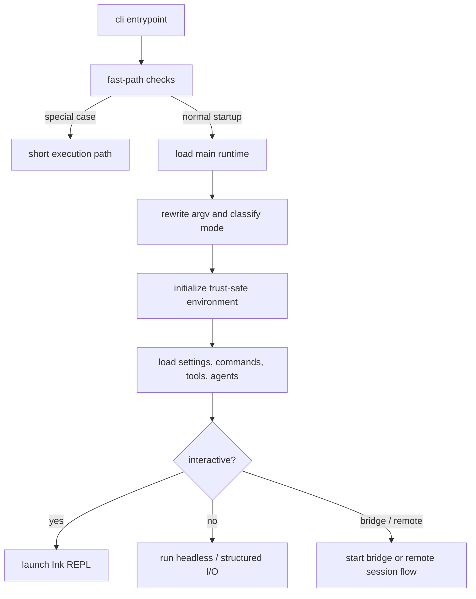
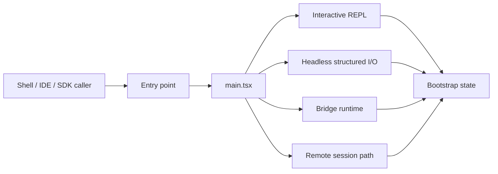

# Chapter 7 - Startup and Execution Modes

## Why startup is a major subsystem

The startup path does more than parse flags. It decides what kind of product instance this process becomes:

- interactive terminal assistant
- headless tool runner
- bridge or remote-control host
- remote session viewer or connector
- specialized one-shot path

Because Claude Code supports several runtime personalities, startup is effectively a topology-selection layer.

## Core implementation surfaces

The startup flow is centered on a small set of files:

- `src/entrypoints/cli.tsx`
- `src/main.tsx`
- `src/entrypoints/init.ts`
- `src/setup.ts`
- `src/bootstrap/state.ts`

At a high level, the process works like this:

## Startup goals

The startup path is trying to satisfy several goals at once:

- avoid loading expensive subsystems when a fast path is enough
- establish enough global state for later subsystems to coordinate
- apply only safe side effects before trust and policy are known
- preserve a consistent project/session identity even if cwd changes later
- keep the door open for very different operating modes

Seen that way, startup is an optimization and correctness layer at the same time.

## Startup responsibilities by phase

One useful way to read startup is as a sequence of widening responsibilities.

| Phase | Main concern | Typical outcomes |
| --- | --- | --- |
| Entry dispatch | Avoid unnecessary work | fast exits, special-case paths, early env tweaks |
| Runtime classification | Decide what kind of session this is | interactive/headless/remote/bridge posture |
| Safe initialization | Prepare shared infrastructure without assuming full trust | config loading, analytics setup, bootstrap data |
| Environment setup | Bind the session to a concrete project and execution context | cwd/worktree/session identity/tooling setup |
| Mode launch | Hand control to the appropriate runtime shell | REPL, structured I/O, bridge, remote flow |

This table highlights why startup spans several files: no single phase can safely do all of these jobs at once.

## Stage 1: a thin dispatcher

The outer CLI entrypoint exists partly to avoid expensive startup when the user only needs a narrow response. It performs cheap checks first and can short-circuit before loading the full runtime.

Architecturally, this keeps Claude Code from paying the full startup cost for every invocation. It also lets product-specific or environment-specific entrypoints stay isolated.

Representative fast paths include:

- `--version`
- system-prompt dumping
- Chrome/Claude-in-Chrome related native-host or MCP helpers
- remote control / bridge serving
- daemon worker and daemon supervisor modes
- background-session management commands such as process listing, logs, attach, and kill

These are not minor conveniences. They show that startup is explicitly engineered to route around the full CLI when a narrower execution path is sufficient.

## Stage 1.5: latency hiding and prefetch

The startup code also tries to hide latency by beginning some expensive work as early as possible. The architectural pattern here is important:

- begin reads or remote fetches before every dependency is fully needed
- let later startup phases consume those results once the rest of the runtime catches up

This is a form of startup pipelining. It improves perceived startup time without collapsing the later execution model.

Examples from the broader startup path include starting reads such as:

- managed-device or managed-settings sources
- secure-storage or keychain prefetches
- bootstrap or remote-configuration fetches

The architectural pattern is "start expensive I/O early, but defer consuming it until the right mode and trust posture are known."

## Why import-time work is tolerated at the entry boundary

In most application code, top-level side effects are suspicious. At the entry boundary of Claude Code, a few are deliberately allowed because they buy back startup time without yet committing the process to a full runtime posture.

Examples visible in `main.tsx` include:

- startup-profiler checkpoints that measure the cost of later module loading
- managed-device or managed-settings reads started before the rest of the import graph settles
- keychain or secure-storage prefetches that can run in parallel with ordinary startup work

The important design constraint is not "no top-level work ever." It is "only top-level work that is safe, bounded, and useful before mode selection finishes." That distinction explains why startup can hide latency without letting uncontrolled side effects sprawl through the rest of Claude Code.

## Stage 2: runtime classification in `main.tsx`

`src/main.tsx` is the true switchboard. Its responsibilities include:

- classifying whether the session is interactive or non-interactive
- recognizing protocol-style launches and remote-style invocations
- building the CLI command surface
- prefetching settings and remote/bootstrap state
- selecting the final operating path

This is where the process stops being "a CLI binary" and becomes a specific runtime instance.

This classification work also includes argument normalization for nonstandard launch styles such as protocol-style or remote-oriented invocation, so later layers do not need to understand every original shell entry form.

## `init()` versus `setup()`

One subtle but important design split is the separation between early initialization and environment-sensitive setup.

- **initialization** prepares the process, loads safe configuration, and gets core services ready
- **setup** handles session and repository-specific wiring, including behavior that depends on the actual working context

This distinction is useful because the runtime cannot assume full trust, final cwd, or final mode at the earliest point in process startup.

Another way to say it: `init()` answers "what kind of process are we allowed to become?" while `setup()` answers "what concrete workspace and session are we now operating in?"

## Startup as reconciliation, not just loading

By the time control reaches the interactive REPL or a headless execution path, startup has already reconciled a surprising number of moving parts:

- CLI arguments may have been normalized or rewritten into internal forms
- settings may have been loaded from several sources and validated
- older configuration may have been migrated into the current shape
- policy and managed settings may already have narrowed the allowed feature surface
- plugin, skill, and MCP-related registries may already be partially assembled
- auth, bootstrap, or remote-managed data may already be prefetched for later use

This is why startup feels wide in Claude Code. It is not merely loading modules; it is reconciling product shape, policy posture, workspace identity, and capability availability into one coherent runtime instance.

## Execution modes

| Mode | Main idea | Typical shape |
| --- | --- | --- |
| Interactive | Full terminal UI with REPL behavior | Ink-based screens, dialogs, background surfaces |
| Non-interactive | One-shot or machine-driven execution | Structured stdout, headless query loop |
| Remote / viewer | Local process connected to a remote engine or session | Filtered commands, transport-aware I/O |
| Bridge / remote control | CLI acts as integration host for another client | Message protocol, control channels, keep-alives |

**Example:** `claude` in a developer terminal, a one-shot headless invocation from another script, and a bridge-hosted session controlled by an IDE all share the same core engine, but startup has to assemble a different shell around that core each time. The mode decision therefore changes far more than presentation; it changes which commands are exposed, how approvals work, and what kind of I/O contract the process must honor.

These modes share code, but they differ in how they:

- read input
- show output
- handle approvals
- persist state
- connect to integrations
- manage background work

An important consequence is that Claude Code does not have one universal "main loop" for I/O. It has a shared execution core wrapped by several presentation and transport shells.

## Mode-specific dependencies

Different modes force startup to resolve different dependencies early:

- **interactive mode** needs UI configuration, key terminal behavior, and human-facing setup surfaces
- **headless mode** needs structured output, reliable non-interactive permission behavior, and machine-readable state updates
- **remote mode** needs transport selection, remote-safe command shaping, and synchronized session metadata
- **bridge mode** needs authentication, message protocols, and host/client coordination state

This is a major reason the startup graph fans out so early.

The important nuance is that these dependencies are not just libraries to import. They are commitments about runtime behavior. For example:

- once startup chooses structured output, later layers must preserve machine-readable boundaries
- once it chooses remote-safe posture, command exposure has to be filtered accordingly
- once it chooses bridge hosting, authentication and policy checks become startup blockers rather than later optional work

## Interactive mode

Interactive mode is optimized for continuous human operation. It emphasizes:

- REPL-style conversation
- live streaming output
- permission dialogs
- slash-command discovery
- task visibility
- session persistence and resume

The startup path in this mode spends effort on user-facing quality-of-life work, such as initialization screens, UI setup, and background prefetches.

## Headless mode

Headless mode is optimized for determinism and machine-readability. It uses a different presentation path, centered on structured output and programmatic control.

This mode is not merely "the same REPL without Ink." It changes assumptions about:

- how status is emitted
- whether prompts can be shown
- how permissions are resolved
- how other processes consume the output

In practice, headless mode behaves more like a protocol endpoint than like a minimal terminal UI. That is why it has dedicated I/O abstractions rather than a simple "print less text" implementation.

## Remote and bridge flows

Remote-style paths treat the process as part of a distributed system. That adds concerns that the interactive local REPL does not have to solve directly:

- transport negotiation
- session synchronization
- remote-safe command filtering
- keep-alives and connection state
- external control messages

This is why remote support is represented by dedicated directories and not just a few flags in the main loop.

## Why startup owns remote-safe command filtering

Remote-safe command filtering appears early because the user-facing command surface is itself part of runtime correctness. If the wrong commands are shown too early, the user can be exposed to capabilities that are invalid in the current transport or authority model.

This is a good example of a recurring architectural principle in Claude Code: **what the user is allowed to see is part of what the system is allowed to do**.

## Global bootstrap state

`src/bootstrap/state.ts` functions as a cross-cutting control plane. It stores runtime-wide facts such as:

- current and original working directories
- session identity and lineage
- interactive vs remote flags
- model and prompt cache state
- telemetry handles
- trust and persistence flags
- session-only feature latches

This is intentionally more than UI state. It is shared runtime infrastructure used across startup, execution, persistence, and observability.

Examples of the kinds of values it centralizes include:

- stable session and parent-session identity
- original cwd versus current operating cwd
- interactive, remote, or bridge posture
- prompt-cache and feature-latch state
- trust, persistence, and session-only mode flags
- telemetry providers and counters

## Why global bootstrap state is tolerated here

In many codebases, a large global state module would be a design smell. Here it exists for a more defensible reason: the runtime has many branches that need to agree on the same session facts very early. Startup, model selection, permissions, telemetry, and persistence all need consistent answers to questions like:

- what session is this?
- what cwd or project root is authoritative?
- what mode is active?
- what feature latches have already been set?

Without a shared state hub, these branches would drift.

## Shared invariants across modes

Even though the runtime has several personalities, certain invariants are deliberately shared:

- there is always a session identity
- there is always a resolved capability surface
- model selection still flows through the same central machinery
- safety and policy state are still consulted before action
- session metadata remains the anchor for persistence and telemetry

This is part of what keeps Claude Code from splitting into several independent apps.

These shared invariants also make later subsystem chapters easier to understand. The query engine, tool system, and session storage can assume some startup work has already normalized identity, mode, and configuration posture.

## Feature gating and build shape

One of the most important architectural choices in startup is heavy use of feature-gated imports. The runtime uses compile-time feature checks to exclude entire product branches from some builds.

That has several consequences:

- imports are often wrapped in conditional `require` patterns
- directories such as bridge, daemon, assistant/proactive, or background-session related areas can represent optional product surfaces rather than always-on code
- startup logic must coordinate both build-time and runtime availability

This makes Claude Code feel larger than any single built artifact.

Chapter 11 returns to this pattern from the operational side and explains why build shape exerts so much pressure on Claude Code's architecture in the first place.

## Why conditional imports are everywhere

The frequent combination of feature checks and lazy imports is not just a bundling trick. It serves three architectural purposes:

1. keep startup fast when a path is irrelevant
2. remove product-specific code from builds that should not ship it
3. reduce accidental coupling between optional branches and always-on runtime infrastructure

Once this is understood, a lot of Claude Code's shape becomes easier to read.

## Startup as product assembly

The startup layer is effectively where Claude Code assembles a specific product configuration from a larger superset of capabilities. That assembly depends on:

- build-time features
- runtime environment
- user configuration
- enterprise policy
- transport and session context

This is why startup logic and packaging logic are so tightly related.

## Runtime topology

## Important implementation details

### Argument rewriting is part of mode selection

Startup does not treat all invocations as plain shell commands. Some inputs are normalized into internal forms before the main runtime decides what to do.

This reduces branching pressure later: downstream runtime code can reason about normalized session intent instead of every raw shell spelling or protocol form.

That normalization is especially important for nonstandard entry styles such as protocol-like launches, assistant-style invocations, and remote-oriented flows. Without rewriting them early, later layers would need to carry many one-off compatibility branches and would be much more likely to diverge in behavior.

### Initialization is trust-aware

The code distinguishes between safe early initialization and later setup that depends on trust or policy. This prevents the process from applying all side effects too early.

This matters because startup touches sensitive areas such as managed settings, keychain or token access, bridge eligibility, and session-affecting environment variables. A trust-aware startup sequence lets the process prepare enough shared infrastructure to continue booting without prematurely committing to privileged or policy-sensitive actions.

### Working directory identity matters

The runtime separates "where the process currently operates" from "what repository or project identity the session belongs to." That distinction matters for worktree mode, session storage, and recovery.

This is one of those details that looks small until the system starts supporting resume, worktree hopping, remote restore, or path-sensitive metadata. A session may need to remember a stable project identity even if the live cwd later shifts for execution reasons.

### Remote safety starts at startup

Remote-specific filtering and transport setup begin before the user is fully inside the session. This reduces cases where local-only behavior leaks into remote contexts.

In practice, that means startup has to treat command exposure, auth checks, policy gates, and transport configuration as part of correctness rather than convenience. If those are delayed, the user can briefly see or invoke capabilities that do not belong to the active remote posture.

### Bootstrap state exists to prevent mode fragmentation

Without a shared session- and mode-aware state module, each execution branch would need to rediscover or recompute core runtime facts independently. Centralizing them reduces divergence between interactive, headless, and remote paths.

The value of that centralization grows with every additional mode. Once startup has to coordinate REPL, structured output, remote control, bridge hosting, background execution, and worktree-aware sessions, a shared control plane becomes less of a shortcut and more of a necessity.

### Startup is where product promises become runtime invariants

Claims such as "sessions can be resumed," "headless output is structured," or "remote mode only shows safe commands" only become true because startup enforces the preconditions that make them possible.

This is why the startup layer deserves to be read as product architecture instead of mere bootstrap glue. It is where user-visible guarantees are converted into concrete runtime posture, validated dependencies, and shared state that later chapters rely on.

## Architectural takeaway

Startup is not scaffolding around the real app. It is the subsystem that chooses the app's shape. Understanding startup is necessary to understand why Claude Code can support a REPL, a headless SDK path, and remote/bridge operation without becoming several unrelated products.
