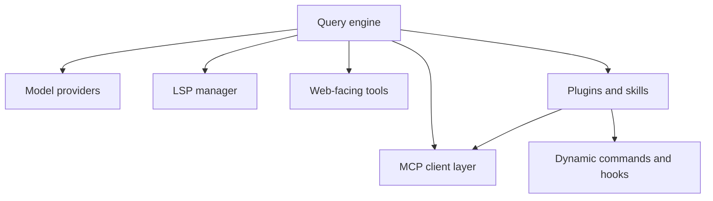
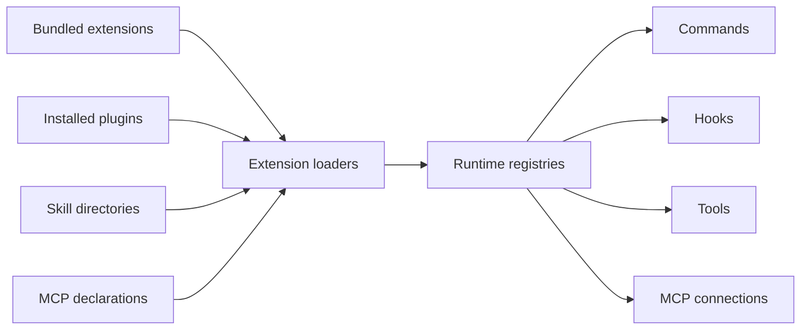

# Chapter 8 - Integrations and Extensibility

## Claude Code is designed to absorb external capability

Claude Code is not a sealed terminal application. It is designed to absorb capabilities and context from multiple external systems:

- different model providers
- MCP servers
- plugins
- skills
- language tooling
- web and remote services

This makes extensibility a first-class architectural theme rather than a plugin folder added at the end.

## Core implementation surfaces

- `src/services/api/`
- `src/services/mcp/`
- `src/plugins/` and `src/utils/plugins/`
- `src/skills/`
- `src/services/lsp/`
- `src/tools/AgentTool/`

## Provider abstraction

The model layer supports several backend styles through a provider abstraction. The rest of the runtime can largely operate against one conceptual model client while provider-specific details remain localized in:

- authentication handling
- request construction
- retry behavior
- capability differences
- bootstrap and metadata fetches

This is what allows the product to support multiple deployment environments without duplicating the whole agent loop.

## API clients as boundary objects

The provider-aware API layer has to protect the rest of the system from backend-specific complexity. In practice, that means it becomes responsible for:

- auth token lifecycle and refresh
- retry and failure classification
- provider-specific endpoint or header shaping
- capability discovery and bootstrap information

The cleaner this boundary is, the more stable the rest of the runtime can remain.

This is especially important because the rest of the runtime wants to think in terms of "submit a model turn" rather than "handle Bedrock-specific auth refresh" or "work around provider-specific bootstrap differences."

## What provider abstraction hides

Even when the rest of the runtime sees a unified client surface, the provider layer still has to absorb significant variation in:

- authentication mechanics
- quota and retry behavior
- capability metadata
- bootstrap data availability
- network and endpoint configuration

This is an example of Claude Code intentionally concentrating complexity at a boundary.

## Integration stack

## MCP as an integration backbone

The MCP subsystem is one of the most important extension surfaces in Claude Code. It is not just a transport adapter; it is a full integration layer that handles:

- server configuration and normalization
- multiple transport types
- connection lifecycle
- tool and resource discovery
- policy filtering
- authentication and elicitation flows

MCP effectively gives the assistant a standardized way to reach capability outside the core binary.

## MCP lifecycle

MCP integration is not a one-time load step. It is a lifecycle:

1. discover or merge server definitions
2. normalize and filter them through policy
3. establish transport and connection state
4. discover tools and resources
5. surface them into the runtime's registries
6. keep the connection healthy enough for later tool or resource access

**Example:** if a GitHub-oriented MCP server is configured, startup may discover its definition, normalize it, establish the transport, learn its tools, and then keep that connection alive so a later issue lookup or PR query feels like an ordinary runtime capability. The visible tool call is only the final step of a much longer lifecycle.

That lifecycle explains why MCP code is spread across config, connection management, transport handling, and tool/resource exposure.

Concrete transport and integration concerns visible in `src/services/mcp/` include support for:

- in-process or stdio-style server communication
- SSE / streamable HTTP style connectivity
- auth and elicitation flows when a server needs user-mediated login or URL handling
- channel notification and allowlisting behavior

This reinforces that MCP is treated as a live subsystem, not just as a static config file format.

## MCP connections are long-lived session participants

The MCP client layer behaves less like a stateless RPC helper and more like session infrastructure. It has to remember connection state, auth posture, discovered tools/resources, and the difference between "the server is temporarily unavailable" and "the session has expired and must be re-established."

That long-lived posture is why the MCP subsystem contains explicit connection managers, auth caches, transport wrappers, and typed error paths for cases like expired sessions or login-required servers. A single tool call may be the visible event, but it depends on a background of connection state that spans the session.

## Why MCP matters strategically

MCP is important not only because it adds tools, but because it changes the growth model of the product. Instead of shipping every integration inside the binary, the runtime can attach to external capability providers through a shared protocol and then run them through the same safety and tool machinery as local features.

In other words, MCP turns extensibility from a packaging problem into a protocol problem. That is a major architectural shift.

## MCP normalization protects the rest of the runtime

External servers are messy in ways that built-in code is not. They may publish extremely large descriptions, duplicate an already-configured server under a different name, expose proxy-rewritten URLs, or return payloads too large or too binary-heavy to drop directly into the transcript.

The MCP layer therefore performs a surprising amount of normalization:

- deduplicating servers by their effective command or URL signature, not just by display name
- unwrapping proxy-style URLs when necessary so equivalent servers can still be recognized as duplicates
- capping descriptions and instructions before they are exposed to the model
- sanitizing and truncating output or persisting large/binary payloads out of band

These are not cosmetic cleanups. They are what let the core runtime treat external capability as governable and legible instead of letting arbitrary protocol payloads destabilize prompts, transcripts, or tool reasoning.

## Plugins

Plugins extend the application at several levels:

- commands
- hooks
- skills
- MCP server declarations
- other runtime metadata

This is an important architectural decision. Plugins are not restricted to one extension point; they can shape both UX and execution behavior.

## Plugin loading as runtime composition

A plugin is not just "code that runs." It is a package of declarations that may contribute several runtime surfaces at once. Loading a plugin can affect:

- visible commands
- hooks and lifecycle callbacks
- MCP connectivity
- skill availability
- configuration semantics

This is why plugin infrastructure touches both startup and runtime composition logic.

There is also a policy dimension here: plugin-provided surfaces may still be filtered by marketplace trust rules, managed settings, or plugin-only customization policies. So plugin loading is partly discovery, partly governance.

## Comparing the extension mechanisms

| Mechanism | Best thought of as |
| --- | --- |
| Provider support | backend portability for the core engine |
| MCP | protocol-based external capability injection |
| Plugins | application-surface extension and packaging |
| Skills | reusable operational knowledge and prompting assets |
| Agents | delegated execution specializations |

**Example:** if a team wants a new slash command, that is plugin-shaped; if they want a reusable "how to do release triage" capability, that is skill-shaped; if they want the runtime to call out to an external bug tracker, that is MCP-shaped. The table is useful because these mechanisms can all feel like "extensions" from the outside while serving very different roles internally.

## Skills

Skills occupy a different niche from plugins. They are closer to reusable operational knowledge or packaged prompting behavior. They are loaded, indexed, and made available to the runtime in a way that still fits the broader execution model.

The distinction is useful:

- plugins change the application surface
- skills change what the assistant knows how to do within that surface

That separation keeps the extension story legible. Without it, every reusable behavior would need to become a full plugin, and simple operational knowledge would be over-engineered.

## Skill lifecycle

Skills typically pass through their own lightweight lifecycle:

- discovery from bundled or directory-backed sources
- indexing or loading into runtime registries
- selective exposure through commands or tools
- invocation inside a broader session context

This lets the runtime treat skills as reusable knowledge assets without forcing them to become full-blown application modules.

Skills also integrate with the rest of the runtime rather than bypassing it. They can be surfaced through commands, discovered for tool-assisted invocation, and tracked as part of session behavior, which is why they appear in both UX- and execution-adjacent parts of Claude Code.

## Agents and delegation

The agent subsystem extends the runtime from single-threaded interaction into delegated execution. Built-in or custom agents can be discovered and launched through the same overall runtime framework.

This chapter treats agents as an extensibility surface: how they are discovered, loaded, and exposed. Chapter 10 covers the separate question of how coordinated multi-agent teams, coordinator/worker relationships, and swarm backends behave at runtime.

This is an architectural multiplier because it allows:

- specialization by task type
- isolated execution contexts
- different tool pools per worker
- background work with later retrieval

## Why agents belong in the extensibility story

Agents are not just another feature; they are a way to extend the architecture's execution topology. Instead of one assistant operating in one context, the runtime can create subordinate workers with:

- narrower goals
- different capabilities
- isolated task context
- separate output and retrieval patterns

That makes delegation a structural extension of the runtime rather than a prompt trick.

## Extension loading model

## LSP and language-aware integration

The presence of LSP-specific tooling shows that Claude Code is not limited to generic shell/file operations. It can integrate with richer semantic tooling where available, improving code navigation and language-aware assistance.

This complements rather than replaces the general tool model.

That distinction matters. LSP is an enrichment layer for better semantic context, but it still has to fit into the same broader runtime expectations around capability exposure, safety, and session continuity.

## Integrations as capability layers, not feature checkboxes

The most important lesson from this chapter is that integrations add different kinds of value:

- providers make the core engine portable
- MCP makes external capability attachable
- plugins make the app surface extensible
- skills make operational knowledge reusable
- LSP makes code reasoning more semantic
- agents make execution topology more flexible

Seeing them as layers clarifies why Claude Code keeps them distinct.

It also clarifies why they are allowed to overlap. A plugin may declare MCP servers; a skill may be surfaced through commands; an agent may use MCP-backed tools. The system is layered, but not artificially siloed.

## Important implementation details

### Provider support is a portability layer

The runtime keeps provider-specific behavior near the API layer so the conversation and tool systems do not need to know which backend is in use.

That isolation is a major architectural win. Without it, provider differences would leak into prompt building, retry logic, tool execution, and session handling, making Claude Code much harder to reason about.

### MCP configuration is merged, not merely loaded

MCP server definitions may come from settings, plugins, and managed or remote sources. The system therefore treats configuration as a reconciliation problem.

That reconciliation has real consequences: the runtime must deduplicate overlapping definitions, respect policy restrictions, preserve trustworthy sources, and end up with one coherent server set that the rest of the system can treat as authoritative.

### MCP is both a tool source and a resource source

The runtime does not only use MCP to obtain callable tools. It also uses it to surface resources and notifications, which is why the MCP subsystem touches command exposure, tool pools, channel messaging, and structured session interaction.

This dual role is one reason MCP becomes a backbone rather than a side integration. It can change both what the assistant can do and what background context the assistant can see or receive.

### Plugins and skills are intentionally different

This separation keeps reusable task knowledge from becoming tangled with full application extensions, while still allowing both to participate in discovery and runtime composition.

The distinction also keeps each mechanism legible to future maintainers. Plugins can stay focused on shaping the application surface, while skills can stay focused on reusable operational capability and prompt packaging.

### Extension points are safety-aware

Plugins, MCP, and other external integrations do not bypass the main safety model. They are filtered through settings, permissions, and policy gates.

That is crucial for keeping extensibility from becoming a back door. External capability may broaden what the system can do, but it still has to enter through the same governed architecture as built-in functionality.

### Extensibility is layered rather than flat

Claude Code does not force every extension into one mechanism. Instead, it uses several extension layers with different responsibilities. That makes the system more complex, but it also makes each layer more semantically precise.

The benefit of that complexity is architectural clarity. Instead of one overloaded extension mechanism trying to handle packaging, protocol connectivity, reusable prompts, and delegated execution at once, each layer specializes in one kind of extension.

### Extensions still have to fit the core runtime contract

No matter where new capability comes from, it still has to fit into the core runtime's expectations about safety, discoverability, invocation, and session continuity. That shared contract is what prevents extensibility from dissolving the architecture into unrelated plugins.

That common contract is one of the main reasons Claude Code can keep adding capabilities without losing its core shape. New extension sources do not get to invent new execution semantics from scratch.

## Architectural takeaway

Claude Code is built to expand outward. Providers, MCP, plugins, skills, and agents all show the same architectural instinct: keep the core loop stable, but make the capability boundary flexible. That is a major reason Claude Code has so many composition layers.
