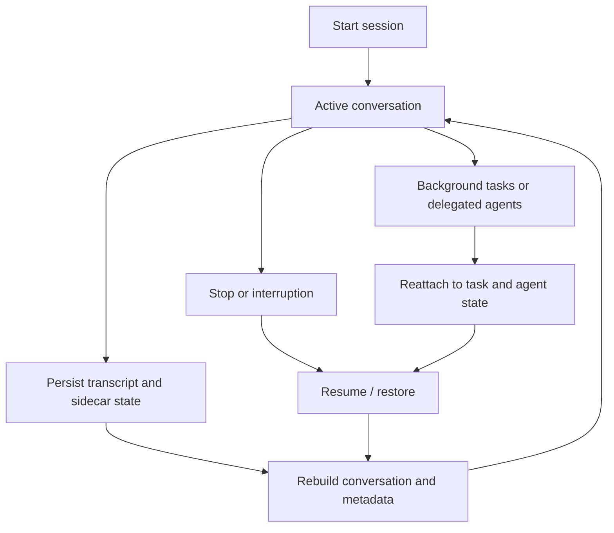
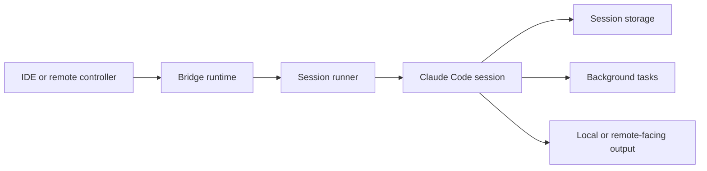

# Chapter 9 - Sessions, Remote Control, and Background Work

## Sessions are durable units of work

A session in Claude Code is not just a transient in-memory conversation. It is treated as a recoverable operating context with identity, metadata, and side effects that may outlive a single process.

This design supports:

- resume after interruption
- recovery after long or complex runs
- background and delegated work
- session sharing and inspection
- remote or bridged continuation

## Core implementation surfaces

- `src/utils/sessionStorage.ts`
- `src/utils/sessionRestore.ts`
- `src/utils/conversationRecovery.ts`
- `src/bridge/`
- `src/remote/`
- `src/tasks/`
- `src/utils/worktree.ts`

## Transcript persistence

The session storage layer persists more than conversational text. It distinguishes between durable transcript data and ephemeral UI-only artifacts, which is important for replay correctness and storage efficiency.

The durable session picture includes:

- transcript entries
- session metadata
- agent-related state
- worktree-related state
- titles, tags, and mode-related metadata
- cost and attribution side information

This makes resume far more reliable than a naive "reload the last text log" approach.

Concrete persisted artifacts described by `src/utils/sessionStorage.ts` include:

- the main session `.jsonl` transcript
- companion metadata such as AI-generated title, mode, and worktree/session markers
- subagent transcript files under session-specific `subagents/` paths
- subagent metadata files alongside those transcripts
- per-task or related sidecar state used to survive task eviction or session restart

## Session storage is a layout, not a blob

One useful way to understand the persistence layer is as a small on-disk layout rather than as "the transcript file."

| Artifact family | Why it exists |
| --- | --- |
| Main session transcript | durable conversational and tool-related history |
| Session sidecars | title, mode, worktree, and other runtime posture that does not fit neatly into every transcript entry |
| Subagent transcript files | delegated work needs separation without losing its relationship to the parent session |
| Per-task or related state | background outputs and status need to survive memory eviction and later lookup |

This layout is an architectural choice. Different kinds of session truth age differently, are read back differently, and need different repair behavior on resume. Splitting them makes the overall system easier to recover correctly.

## Transcript semantics

The transcript is not simply a chat log. It is a structured record of session-relevant events. The storage layer has to preserve enough ordering and message meaning to support:

- replay into later context
- recovery after interruption
- debugging of long-running tool or task flows
- reconstruction of what the assistant and user actually saw

That is why Claude Code distinguishes durable transcript entries from ephemeral progress artifacts.

The storage code is explicit that high-frequency progress events should not become first-class transcript history. This protects the parent/child message chain used for recovery and prevents old sessions from being polluted by UI-only progress noise.

## Session identity and lineage

The runtime tracks more than a session ID. It also needs to model relationships among sessions, such as:

- resumed sessions
- sessions that transition from planning to execution
- subagent or delegated work associated with a parent session
- worktree-isolated variants of the same logical task

This lineage perspective is one reason state handling is more sophisticated than a single transcript file.

The session-storage layer reflects this explicitly by keeping related artifacts under session-aware paths and by maintaining helper functions for current-session, other-session, and agent-relative transcript resolution.

## Session lifecycle



## Recovery as a multi-step process

Recovery can be understood as several phases:

1. locate the authoritative session artifacts
2. reload transcript and sidecar metadata
3. repair or reconcile message-chain continuity
4. reconstruct runtime-facing state such as pending work or mode posture
5. present the restored session through the current interface

**Example:** if the user closed the terminal while a session already contained tool results, background task handles, and a compacted history boundary, resume has to rebuild all of those pieces coherently. A successful restore means the user sees "the same work continuing," not merely an old transcript dumped back onto the screen.

This phased view explains why recovery logic is spread across storage, restoration, and conversation-oriented helpers.

The recovery code also has to respect invariants introduced elsewhere in the architecture, such as:

- compact-boundary semantics
- tool-use/tool-result pairing
- sessionProjectDir versus original project-root identity
- remote or delegated-session metadata that may not live in the main transcript alone

## Resume includes semantic repair

`conversationRecovery.ts` makes it clear that resume is not just "deserialize JSON and continue." The loader actively repairs the session into a shape that the current runtime can trust.

Examples of that repair work include:

- migrating legacy attachment forms into the current attachment vocabulary
- stripping invalid or build-incompatible permission-mode values from stored messages
- filtering unresolved tool uses that would otherwise leave the transcript structurally inconsistent
- removing orphaned thinking-only assistant fragments or whitespace-only partial messages that can appear after interrupted streaming
- inserting synthetic continuation or assistant-sentinel messages so the resumed conversation remains API-valid even before the next real turn executes

This is one of the strongest signs that the session subsystem is preserving meaning rather than bytes. Old sessions are normalized into a usable present-tense runtime state instead of being treated as untouchable historical artifacts.

## Why recovery is hard

Recovery has to account for more than the message list. The runtime must restore or reconcile:

- pending tool-use context
- transcript chain integrity
- background task visibility
- remote session metadata
- worktree identity
- plan and mode-related state

That is why recovery is handled by dedicated utilities rather than a quick JSON reload.

## What recovery must preserve semantically

The goal of recovery is not only to reload bytes from disk. It is to restore the user's mental model of "where the session was." That includes:

- what the assistant was doing
- what background work is still relevant
- what repository context the work belongs to
- what mode or trust posture was active

That is a much richer target than merely recreating prior chat text.

## Bridge and remote control

The bridge subsystem turns the CLI into a networked participant. It supports scenarios where another client, IDE, or remote host needs to coordinate with a Claude Code session.

Architecturally, this introduces:

- message protocols
- transport abstractions
- session runners
- authentication helpers
- synchronization and keep-alive behavior

This is a distinct concern from the ordinary local REPL, even though both eventually interact with the same query and tool infrastructure.

## Session runners and transport boundaries

The bridge and remote subsystems need a layer that can treat a Claude Code session as something to launch, supervise, and exchange messages with. That creates a transport boundary where the session is no longer just an in-process interaction loop, but also an addressable remote participant.

This is why bridge code includes concepts such as runner processes, JWT/auth helpers, transport wrappers, and remote metadata hydration. The session must be made addressable and resumable across process and network boundaries.

Put differently, the bridge/remote layer has to preserve the illusion that a remote or bridged session is still "the same session," even when the transport and host process are different.

## Remote topology



## Tasks and background work

Background work is modeled explicitly through task abstractions rather than as ad hoc threads or detached shell commands. This enables:

- durable task identity
- polling and status retrieval
- integration with transcript and UI
- background agent workflows
- eventual result retrieval

**Example:** a long-running test command or delegated research agent may outlive the moment when the user first launched it. Because it is tracked as a task rather than as an anonymous subprocess, the session can later show its status, reconnect to it, and surface the result back into the conversation when it completes.

The task model is what allows Claude Code to support long-running delegated work without losing coherence.

## Durability for background work

Background work is only useful if it can survive the realities of actual use:

- the user may leave the session and return later
- a remote viewer may reconnect
- multiple delegated workers may be active
- the transcript may need to reference incomplete work

This is why background work is modeled with explicit status, identity, and retrieval paths instead of being left as untracked process state.

The session-storage layer reinforces this by storing background or delegated outputs in locations that survive ordinary in-memory eviction. That design choice makes later retrieval possible even when the live task list has changed.

## Background work as part of the conversation model

A notable design choice is that background work is still visible through the same broader session framework. Instead of disappearing into process state, tasks can surface:

- progress
- results
- follow-up retrieval
- relationship to the current session

This keeps asynchronous work understandable from the user's point of view.

## Not every worker signal goes to the same place

One reason this topic can feel blurry is that Claude Code deliberately uses several visibility channels for the same worker.

| Channel | Main consumer | Typical artifact |
| --- | --- | --- |
| **Worker transcript** | recovery, inspection, deep debugging | subagent/session transcript files |
| **Task output** | task polling, status retrieval, later fetch | task handle plus output path or captured result |
| **Coordinator notification** | the supervising thread | structured `<task-notification>` result messages |
| **Mailbox traffic** | teammates and permission coordination | team inbox files and related request/response artifacts |

The point is not to duplicate information needlessly, but to project the same work at different levels. Intermediate worker chatter can stay out of the parent transcript while final results still become visible to the coordinator and retrievable through the task/session layer.

## Worktrees and isolation

Worktree support is a good example of how operational concerns become part of session identity. A session may not just represent "a prompt history" but "a prompt history tied to a particular isolated repository workspace."

That matters for:

- safe experimentation
- concurrent tasks
- background agents
- resume fidelity

Worktrees effectively extend the session model into repository topology. They help the runtime preserve the idea that separate lines of work may deserve separate filesystem contexts even when they originate from the same user or repository.

## Why worktrees belong in this chapter

Worktree handling is easy to think of as a git convenience feature, but architecturally it is part of session isolation. It changes the effective workspace, the identity of some persisted state, and the safety of concurrent experimentation.

## Important implementation details

### Representative logic sketch

A simplified persistence and recovery path looks like this:

```ts
await saveSession({
  transcript,
  meta: { mode, title, worktree, parentSessionId },
  tasks,
  subagents,
})

const restored = await loadSession(sessionId)
const messages = rebuildConversation(restored.transcript, restored.meta)

registerBackgroundTask({
  id: taskId,
  parentSessionId: sessionId,
  kind: 'agent',
})
```

The actual session layer uses more sidecar files and recovery helpers than this sketch shows, but the basic idea is visible: Claude Code persists both the transcript and the metadata needed to restore meaning, then ties background work back into that same durable session identity.

### The transcript is not the whole session

Sidecar metadata and related persisted state are necessary to restore the actual runtime posture of a session.

Examples include re-appended session metadata, AI-generated titles, coordinator/normal mode markers, worktree linkage, and per-agent metadata stored next to subagent transcripts.

Without those side artifacts, the runtime could recover raw messages but still lose the operational meaning of the session: what mode it was in, what delegated work existed, and how that work related to the parent session.

### Ephemeral progress is intentionally excluded from durable history

This prevents noisy transient updates from corrupting recovery semantics or bloating transcript storage.

The rationale is especially clear: ephemeral progress should not participate in the parent-UUID chain that later recovery logic uses to rebuild the conversation correctly.

This is a good example of Claude Code distinguishing between **what users need to see live** and **what the system must remember durably**. Those are related, but not identical, concerns.

### Remote operation reuses the same core engine

The system does not build a second agent runtime for bridge or remote paths. Instead, it adds transport and coordination layers around the same central execution model.

That reuse keeps local and remote behavior aligned. A remote or bridged session may feel operationally different, but it still relies on the same underlying turn model, tool system, and persistence semantics.

### Background work is integrated with the session model

Tasks and delegated agents are visible, persistent, and recoverable because they are designed as session citizens rather than side effects outside the runtime.

This is why background work can later be queried, resumed, surfaced in UI, or tied back to parent context. The task system is not just about running work later; it is about keeping that work legible inside the broader session.

### Subagents are stored as first-class session relatives

The subagent transcript layout under session-specific subdirectories shows that delegated work is not bolted on. It is treated as a structured extension of the parent session.

That storage layout gives the runtime a way to preserve both separation and relationship: subagents have their own transcript artifacts, but they still live under the parent session's durable umbrella.

### Remote and local continuity share the same abstraction

Whether the session is resumed locally, viewed remotely, or coordinated through a bridge path, Claude Code tries to preserve one coherent notion of session state rather than inventing unrelated representations for each channel.

This is one of the reasons the session abstraction is so central. It acts as the common denominator that lets multiple transports and interfaces point at the same underlying unit of work.

### Recovery is about restoring meaning, not just data

The best way to read the session infrastructure is to see it as preserving the meaning of prior work: what was asked, what was done, what is still pending, and what environment that work belonged to.

That perspective explains why recovery code has to care about metadata, pairings, worktree identity, and task state. A purely textual restore would not be enough.

## Architectural takeaway

Sessions are Claude Code's continuity mechanism. By treating them as durable, structured units of work, Claude Code can support resume, delegation, remote control, and long-running workflows without turning every restart into a fresh start.
