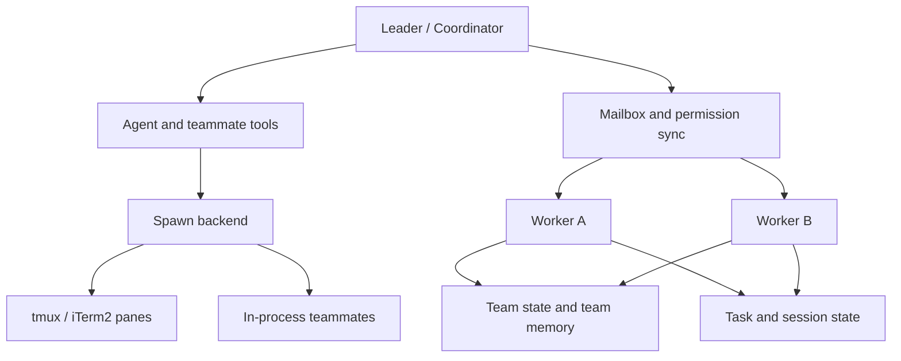

# Chapter 10 - Multi-Agent Coordination and Swarm Architecture

## Why this chapter matters

Claude Code is not limited to one assistant working in one context. Claude Code contains a substantial architecture for **delegation, coordination, teammate execution, and cross-worker state management**.

That matters because the jump from one agent to many is not just a scaling trick. It changes several architectural assumptions at once:

- work can proceed concurrently
- permissions may need to be resolved on behalf of other workers
- state must be partitioned and then re-synthesized
- backends may be process-local or pane-based
- worker output must be visible without becoming ordinary user conversation

This topic deserves its own chapter because the existing chapters describe agents, tasks, and sessions, but the **coordinator/team topology** is more than the sum of those parts. It is an alternate execution model.

## Core implementation surfaces

- `src/coordinator/coordinatorMode.ts`
- `src/tools/AgentTool/`
- `src/tools/shared/spawnMultiAgent.ts`
- `src/utils/swarm/`
- `src/utils/teammate.ts`
- `src/utils/teammateMailbox.ts`
- `src/tasks/InProcessTeammateTask/`
- `src/services/teamMemorySync/`

## Coordinator mode is a different operating posture

The coordinator path is not just "the same assistant, but more willing to call the agent tool." `coordinatorMode.ts` defines a different identity for the main thread:

- the main thread becomes a coordinator
- subordinate workers perform research, implementation, or verification
- the main thread synthesizes findings and decides what to launch next
- worker completion messages arrive as structured internal notifications rather than ordinary chat responses

This is an important distinction. Coordinator mode turns the main agent from a direct executor into a **manager of other execution contexts**.

Throughout this chapter, **coordinator** is the primary term for the main supervising thread. When permission-sync or mailbox paths use the word **leader**, they refer to that same coordinator seen from the authority side of the workflow. **Worker** is the generic term for a subordinate execution unit. **Agent** names the model-backed role being launched, while **teammate** names the concrete swarm participant - pane-based or in-process - that carries that worker through the runtime.

## The coordinator prompt defines a workflow model

One of the most revealing details in `coordinatorMode.ts` is that the coordinator system prompt encodes not only behavior, but also an explicit workflow:

1. research
2. synthesis
3. implementation
4. verification

It also encodes concurrency guidance, worker-prompt guidance, and rules for when to continue an existing worker versus launching a fresh one.

This means the multi-agent architecture is not just runtime plumbing. It includes a product-level operating model for how delegated work should be structured.

## Delegation is broader than one worker type

Claude Code actually contains several delegation patterns that are easy to blur together but are architecturally distinct:

| Pattern | Main idea | Typical use |
| --- | --- | --- |
| Fresh worker | start a new specialized execution context | independent research or implementation |
| Continued worker | resume a prior worker with preserved local context | follow-up after failure or refinement |
| Forked worker | branch from the current agent with inherited context | exploratory or cache-friendly continuation |
| Background worker or task | let work continue asynchronously with later retrieval | long-running operations that should outlive the current visible turn |

Claude Code treats these forms differently because they have different tradeoffs around context inheritance, result retrieval, and lifecycle control.

## Agent definitions are loaded, filtered, and specialized

The `AgentTool` subsystem is larger than the command surface suggests. It has to answer several questions before a worker can even begin:

- which agents exist
- whether they are built-in, custom, or plugin-provided
- what tools each agent is allowed to use
- what prompt and memory each agent should carry
- whether the requested work should run as a fresh agent or as a fork

This matters because multi-agent systems quickly become chaotic if workers are created ad hoc. Claude Code instead treats agent definitions as data with their own loading and override rules.

## Fresh-context workers and forked workers are intentionally different

One of the most important distinctions in `AgentTool/prompt.ts` is between a worker launched with an explicit agent type and a worker launched through the fork path.

**Example:** a fresh research worker may start with a focused "investigate the build failures" role and only the tools that role needs, while a forked worker may inherit the parent thread's live debugging context because the goal is to branch the current reasoning, not to specialize from scratch. The two forms look similar in the UI, but they solve different coordination problems.

Those two modes have different meanings:

- an explicitly typed worker starts as a **fresh context** that is shaped by the selected agent definition
- a forked worker inherits much more of the current execution context and is therefore closer to a branch of the current conversation

This is an architectural distinction, not just a UX nuance. Fresh workers are better for specialization and isolation. Forked workers are better when continuity matters more than strict separation.

## Worker results return as structured notifications

Coordinator mode does not rely on free-form worker chatter alone. It defines structured result-notification semantics so the coordinator can distinguish:

- a worker that is still progressing
- a worker that is waiting for input
- a worker that has produced a final result worth synthesizing

This is why the coordinator can behave like a manager rather than like a passive transcript reader. The result channel carries enough structure for the coordinator to make orchestration decisions.

## Teammate identity is a first-class runtime concept

The swarm subsystem tracks more than "some worker process." A teammate has explicit identity such as:

- agent ID
- agent name
- team name
- color and display identity
- plan-mode requirements
- relationship to a parent session

This is not cosmetic metadata. It determines routing, resume behavior, UI presentation, mailbox addressing, and permission coordination.

The presence of dedicated teammate and agent-ID utilities shows that identity is part of runtime correctness. A swarm cannot function reliably if workers are anonymous.

## Context isolation is explicit

Claude Code supports both pane-based teammates and in-process teammates, which creates a hard problem: worker-local state must be isolated even when some workers share a process.

The code addresses this with explicit teammate context handling rather than implicit globals. In-process teammates rely on context carriers that let nested code understand:

- which teammate is active
- which team it belongs to
- what session lineage it should report under
- which permission and display context belongs to it

This is a good example of Claude Code reusing the same execution engine while still creating real worker boundaries.

## Execution backends are architectural, not just operational

The `utils/swarm/backends/` directory shows that the system is designed to run teammates through more than one backend:

- tmux-based panes
- iTerm2-based panes
- in-process execution

At first glance this can look like deployment detail. It is actually a meaningful architectural layer because backend choice changes:

- how teammate I/O is routed
- how lifecycle is controlled
- how UI and pane layout are synchronized
- what resources are shared versus isolated

This is why Claude Code separates low-level pane backends from higher-level teammate executors. The system needs a common swarm model across different execution substrates.

## Backend selection and fallback

The backend registry exists so the runtime can detect what the current environment can support and fall back sensibly when a preferred mode is unavailable.

That fallback behavior matters because a swarm feature that only works in one terminal setup would not be a reliable architecture. Claude Code instead tries to preserve the same top-level teammate model across:

- fully visual pane-oriented swarms
- environments where pane automation is not available
- situations where in-process execution is the safest or cheapest path

In other words, backend selection is how the swarm architecture stays portable.

## Spawn inheritance is intentional

`spawnUtils.ts` shows that teammates inherit more than a command line. The runtime deliberately propagates selected flags and environment state such as:

- permission posture
- model selection
- settings paths
- inline plugin directories
- teammate mode
- remote- or proxy-related environment variables

This inheritance model matters because teammates are supposed to act as coherent extensions of the current session, not as random fresh processes with unrelated configuration.

There is also a safety nuance here: plan-mode requirements can intentionally suppress bypass-style inheritance so the parent cannot accidentally create workers with broader trust than intended.

## Mailbox messaging is the coordination backbone

The swarm subsystem uses mailbox-style messaging so teammates and the coordinator can exchange structured information asynchronously.

This is one of the most important design decisions in the entire multi-agent architecture. Mailboxes make it possible to coordinate:

- permission requests
- permission responses
- worker-to-coordinator status messages
- directed teammate-to-teammate communication
- eventual notifications in environments where workers are not sharing one immediate UI surface

The result is a swarm that behaves more like a small distributed system than like a single threaded terminal app.

## Permission coordination across workers

Permissions become much more interesting in a swarm. A worker may hit a tool request that needs approval, but the authoritative UI or trust decision may live with the coordinator.

**Example:** one teammate might discover that fixing a bug requires a higher-risk shell command. Instead of inventing its own trust boundary, it packages the request, hands it to the coordinator path, waits for approval or denial, and only then continues. This keeps a multi-agent session from turning into a collection of unsynchronized local permission decisions.

`permissionSync.ts` makes the coordination pattern explicit:

1. a worker packages a structured permission request
2. the request is written to team-scoped storage or mailbox channels
3. the coordinator observes it
4. the coordinator resolves the request through its own approval path
5. the result is sent back as a structured response
6. the worker continues or stops based on that resolution

This is not a small extension of the ordinary permission dialog flow. It is a separate coordination protocol layered on top of the existing safety model.

## Permission sync uses shared state, not just transient prompts

The permission-sync path is especially interesting because it is not purely conversational. The swarm utilities use team-scoped directories and request artifacts so workers and the coordinator can coordinate even when they are not sharing one synchronous UI surface.

That design buys the system several properties:

- workers can block safely while waiting for a decision
- the coordinator can resolve requests in a stable order
- concurrent teammates do not overwrite each other's requests
- file locking can be used where necessary to preserve consistency

This is why the permission system in swarm mode feels more like mailbox coordination than like a modal dialog copied into multiple panes.

## Coordinator-side permission bridges

The coordinator-side permission bridge exists because the runtime must translate between two different worlds:

- a worker's local request for tool authorization
- the coordinator's interactive confirmation surface and current permission context

This bridge is one of the best examples of how swarm code extends existing architecture rather than bypassing it. Workers do not invent their own permission logic; they escalate to the same trust boundary the main session already uses.

## In-process teammates are integrated as tasks

The in-process backend is especially interesting because it shows Claude Code adapting swarm execution to application-scale constraints. Instead of treating a teammate as only a subprocess or a pane, the runtime can represent it as a task-like unit inside application state.

This allows:

- progress visibility in the main UI
- lifecycle control through task-like handles
- idle, running, and completion state transitions
- output eviction or truncation policies so a large swarm does not exhaust memory

That last point is especially important. Once many teammates can coexist inside one process, multi-agent architecture becomes a resource-management problem as well as a coordination problem.

## Team snapshots make teammate state portable

The swarm utilities keep snapshots and registries of teammate mode and backend state so the runtime can reconstruct how a team was configured. This is important for resume, for reconnecting the coordinator to workers, and for making sure the wrong backend assumptions are not applied after a restart.

In other words, a swarm is not only a set of running agents. It is also a description of how those agents were arranged.

## Team state lives on disk

`teamHelpers.ts` reveals that teams are not purely in-memory concepts. The runtime persists team state such as:

- membership
- pane IDs or backend metadata
- session linkage
- mode state
- allowed-path information

This makes team state durable enough for recovery, cleanup, and cross-process coordination. It also means the swarm architecture is legible from the filesystem, not just from transient runtime objects.

## Team memory extends coordination beyond one turn

The presence of team-memory-specific paths and synchronization services shows that a swarm is not only a way to parallelize current work. It is also a way to build and reuse shared knowledge among teammates.

This is a qualitatively different concept from ordinary session memory:

- session memory summarizes one session's evolving state
- team memory supports cross-teammate or repeated collaborative knowledge

That distinction matters because it turns multi-agent work from mere concurrency into a more persistent coordination model.

## Agent memory and team memory solve different problems

Claude Code supports both agent-scoped memory and team-scoped memory because specialization happens at more than one level.

- **agent memory** helps a particular agent type carry durable role-specific guidance
- **team memory** helps a collection of workers share durable coordination context

This split is important. A code-review worker and a planning worker may need different long-lived local guidance even when they participate in the same team.

## Swarm topology

## Why swarms are not just background tasks

It would be easy to say that swarms are "background tasks, but more interactive." The architecture is richer than that.

Compared with ordinary background work, swarms add:

- teammate identity
- coordinator/worker authority relationships
- mailbox-mediated communication
- coordinated permission handling
- backend-aware execution and visualization
- team-level state and memory

So while swarm workers may appear as tasks in some places, the architecture around them is broader than the task system alone.

## Why swarms are not just agent tool reuse either

The opposite mistake is to think that swarms are only the agent tool used more often. Claude Code clearly layers additional machinery around agent spawning:

- coordinator prompts
- backend selection
- coordinator bridges
- permission synchronization
- team files
- mailbox protocols
- teammate layout and display

This is what turns delegation into a topology rather than a one-off tool call.

## Important implementation details

### Coordinator mode changes the main thread's job

In coordinator mode, the primary agent is expected to synthesize, route, and supervise rather than doing all work directly. That is a real change in execution posture, not just a prompting style preference.

### Worker identity is part of correctness

Agent IDs, team names, colors, and parent-session relationships are used for routing, resume, UI, and permission flows. The swarm subsystem depends on durable identity, not anonymous subprocesses.

### Backend abstraction protects the swarm model

Claude Code supports pane-based and in-process teammates through a common coordination model. This lets the top-level swarm behavior stay consistent even when the underlying execution substrate changes.

### Permission prompts become distributed coordination

Workers can require coordinator-mediated approval, so permission handling becomes a protocol rather than a purely local dialog. This is one of the biggest reasons the swarm subsystem deserves separate study.

### Fresh workers and forks carry different isolation guarantees

An explicitly typed worker starts in a purpose-built context, while a forked worker inherits much more of the parent thread's state. Claude Code preserves both forms because specialization and continuity are different architectural needs.

### Team state is durable, not incidental

Persisted team files and team memory make the multi-agent architecture recoverable and inspectable. A swarm is treated as ongoing state, not as a temporary burst of subprocesses.

### Forks, workers, and background tasks are intentionally different

Claude Code offers several ways to delegate work because context inheritance, lifespan, and supervision requirements are not always the same. Treating them as one mechanism would make the execution model less predictable.

## Architectural takeaway

The swarm subsystem turns Claude Code from a single-agent runtime into a coordination runtime. By adding worker identity, backend abstraction, mailbox communication, coordinator-mediated permissions, and durable team state, Claude Code supports parallel software-engineering work without collapsing into uncontrolled concurrency. This is one of the clearest examples of Claude Code behaving like an orchestration platform rather than a simple assistant shell.
