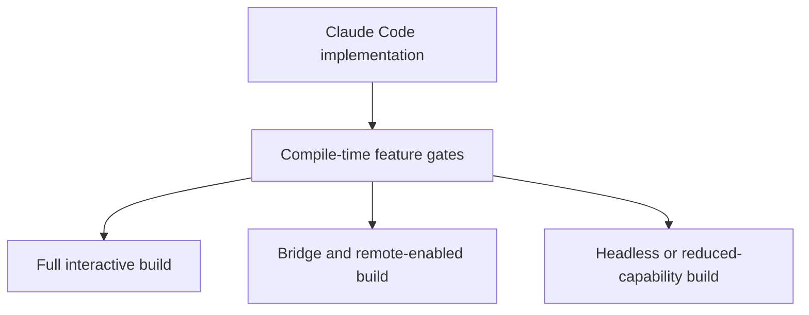
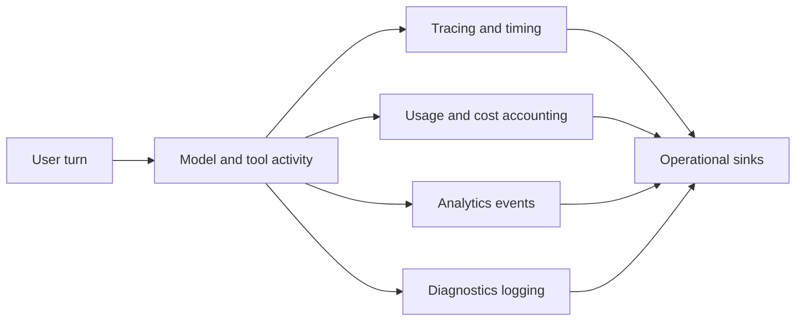

# Chapter 11 - Operations, Observability, and Build Shape

## Why this chapter matters

A large part of Claude Code's apparent complexity comes from operational needs:

- shipping different product shapes
- collecting telemetry without dominating the core loop
- tracking cost and performance
- keeping diagnostics useful for hard-to-reproduce sessions
- preserving prompt-cache efficiency

These concerns heavily influence how Claude Code is organized.

## Core implementation surfaces

- `src/services/analytics/`
- `src/utils/telemetry/`
- `src/cost-tracker.ts`
- `src/utils/diagLogs.ts`
- `src/bootstrap/state.ts`
- feature-gated imports throughout `src/main.tsx`, `src/commands.ts`, and `src/tools.ts`

## Feature-gated architecture

Claude Code uses compile-time feature gating to shape the build artifact. This is more powerful than ordinary runtime feature flags because entire branches of code can be omitted from certain builds.

This explains several stylistic patterns in Claude Code:

- conditional `require` blocks
- product-specific directories that may be dormant in some builds
- explicit separation between always-on infrastructure and optional product branches

The architectural consequence is that Claude Code is a superset of several runtime products.

Concrete examples of gated product branches in the source include bridge mode, daemon-related flows, background-session management, proactive/assistant-oriented features, transcript-classifier paths, and other optional subsystems that are only meaningful in some builds or environments.

## Build shape as an architectural input

In many repositories, packaging is an afterthought applied after the software is designed. Here, build shape influences the design itself. Optional product branches have to remain separable enough that the bundler can exclude them cleanly, which pushes Claude Code toward:

- explicit boundaries
- lazy loading
- optional import edges
- product-specific containment

## Why build shape affects the implementation layout

Because optional branches are real product surfaces, Claude Code often keeps them separated enough to be removable. This encourages:

- conditional imports
- boundary modules that stay light until needed
- clearly isolated optional subsystems

What might otherwise look like over-engineering is often the result of bundling and product-shaping pressure.

## Build-shape sketch

## Telemetry and diagnostics

Observability is layered rather than monolithic. Claude Code distinguishes among:

- analytics events
- diagnostics logs
- tracing/performance signals
- session and prompt identifiers
- cost and usage accounting

This separation helps the system answer different operational questions:

- what features are being used?
- what failed?
- where was time spent?
- what did the session cost?

It also keeps the user-facing experience cleaner by avoiding a single overloaded logging channel.

## Observability layers by purpose

| Layer | Primary purpose |
| --- | --- |
| Analytics | product usage and behavior trends |
| Diagnostics | debugging specific failures or environmental issues |
| Tracing | timing and causal understanding of complex flows |
| Cost tracking | resource accountability across a session |

This separation reveals a mature operational model: Claude Code expects to be asked very different questions after the fact, and one log stream would not answer them all.

## Analytics is deliberately delayed and scrubbed

The analytics layer is designed so the rest of the application can emit operational events early without forcing startup to wait for the final sink wiring. Events can be queued until the analytics sink attaches, then drained asynchronously once initialization catches up.

**Example:** a startup-time authentication or tool-registration event may occur before the final analytics sink is ready. The runtime can queue it, scrub or classify the metadata, and only later forward a safe operational record instead of either dropping the event or blocking startup on telemetry wiring.

Just as importantly, analytics metadata is treated as a data-governance problem, not just a convenience API. The analytics service distinguishes between ordinary safe metadata, specially tagged values, and proto-only fields that must be stripped before routing events to broader-access sinks. That makes observability safer by construction rather than by convention.

## Cost tracking

Cost is tracked explicitly instead of being inferred on demand. This is important because the application supports:

- several model providers
- long-running sessions
- background work
- session switching and resume

Persistent cost tracking turns resource usage into a session property rather than a temporary statistic.

## Cost lifecycle

Cost accounting follows the lifecycle of the work rather than a single request:

1. usage is produced by model interaction
2. usage is normalized into cost-relevant values
3. cumulative totals are attached to the session
4. resumed or switched sessions keep that accounting meaningful over time

This fits the broader design choice to treat sessions as durable units of work with operational consequences.

## Cost state survives session switches

`cost-tracker.ts` makes the operational model especially concrete: cost is saved and restored as session-associated state rather than recomputed from scratch every time the user changes context.

That means the product can preserve:

- cumulative cost across resumed work
- model-by-model usage breakdowns
- tool-duration and API-duration totals
- lines-added/removed style side metrics that matter to workflow reporting

In architectural terms, cost is not a report layered on top of the product. It is part of the persisted operational identity of a session.

## Observability flow

## Prompt-cache awareness

Chapter 3 explains the mechanics of prompt shaping and cache discipline. The emphasis here is narrower: why that discipline matters for operations, latency, and product economics.

One subtle operational theme is prompt-cache stability. Several parts of Claude Code are designed to avoid unnecessary variation in the model request envelope. That affects:

- system prompt section ordering
- feature headers
- tool ordering and visibility
- compaction behavior

This is an example of performance concerns shaping architecture at the boundaries of prompting and state management.

## Cache stability as a design constraint

Once prompt caching is important enough, the runtime has to care about stability in places that would otherwise feel unrelated:

- how system prompt sections are partitioned
- whether feature headers remain sticky once introduced
- whether tool ordering changes between turns
- whether compaction preserves useful cache boundaries

That is a strong example of low-level operational economics influencing high-level architecture.

## Prompt-cache stability as product engineering

Claude Code treats cache stability as a cross-cutting optimization rather than a local implementation detail. That is why seemingly distant areas, such as feature latches in bootstrap state or stable tool ordering, can still be explained in terms of cache behavior.

## Cache latches turn transient modes into stable request envelopes

One of the more revealing details in `bootstrap/state.ts` is the number of sticky feature latches whose job is to keep prompt-shaping headers stable once a session has crossed a capability boundary.

**Example:** if a session briefly enters an auto or AFK-oriented posture, the runtime may keep the related prompt-shaping headers stable even after later local toggles. That can look slightly conservative from a UI perspective, but it preserves a more stable request envelope and therefore better prompt-cache reuse across the rest of the session.

Examples include latches for fast-mode headers, AFK/auto-mode headers, cache-editing behavior, and thinking-clearing posture. These latches show that the runtime is willing to remember operational history in order to keep the prompt envelope stable across later toggles.

That is a subtle but important architectural choice. Instead of representing every mode change as a fresh prompt shape, the system sometimes preserves a broader "session has entered this category" fact so that server-side prompt caches remain useful.

## Diagnostics without overwhelming the user

The runtime must capture enough information to debug hard failures while still operating as a user-facing terminal application. This leads to distinct channels for:

- visible output
- structured SDK output
- internal diagnostics
- analytics and tracing

The system therefore treats "output" as several different products, not one stream.

## Output channels as product surfaces

The distinction between visible output, structured output, internal diagnostics, and telemetry also means Claude Code has to think about output routing as product design. Different consumers expect different contracts:

- humans want readability and continuity
- SDK clients want stable machine-readable events
- developers want detail rich enough for debugging
- operators want aggregates, trends, and traces

This is another way Claude Code behaves more like a platform than like a simple terminal app.

Claude Code therefore has to maintain discipline about what goes where:

- transcript output should stay user-comprehensible
- structured I/O should remain stable for programmatic consumers
- diagnostics should be rich enough for debugging without polluting the ordinary session
- analytics and tracing should capture operational truth without becoming user-facing noise

## Cost, tracing, and telemetry as session infrastructure

These subsystems are best understood as part of session infrastructure rather than as optional observability extras. They track what happened over the lifetime of a workflow, which fits Claude Code's broader view that a session is a durable unit of work.

## Important implementation details

### Build gating and runtime gating work together

Compile-time gating removes code entirely, while runtime gating still decides whether enabled code should activate in the current environment.

That distinction explains why Claude Code often combines `feature(...)` checks with later policy, auth, or GrowthBook gating. Shipping a capability and allowing it are intentionally separate decisions.

This two-step model helps Claude Code balance product shape and product control. Build-time gating keeps bundles lean and target-specific; runtime gating keeps shipped capability subject to environment, entitlement, and policy.

### Observability is session-aware

Telemetry, tracing, and cost are associated with session identity, not just with isolated API calls. This matches the product's emphasis on long-lived workflows.

That session-awareness is what makes later inspection meaningful. It lets the product talk about the behavior, cost, and health of an entire workflow instead of only about disconnected requests.

### Diagnostics are intentionally separated from user-facing text

The code distinguishes between what the user should see during normal operation and what operators or developers need for debugging.

This separation protects both audiences. Users are not overwhelmed with raw internals during normal operation, and operators still get the detailed signals they need when something goes wrong.

### Packaging constraints influence code layout

The use of conditional imports and feature-specific branches is not just style; it exists to keep bundled outputs lean and product-targeted.

That is why some boundaries in Claude Code are surprisingly sharp. They are not only conceptual seams; they are also packaging seams designed to support dead-code elimination and variant product assembly.

### Operational concerns influence the architecture early

Claude Code does not add telemetry, tracing, cost, and packaging concerns at the end of the pipeline. They are present in bootstrap state, startup flow, provider handling, and query execution, which shows how central they are to the product.

This early presence is a sign of maturity rather than clutter. The system is designed with the expectation that performance, cost, and diagnosability are first-class product qualities, not post-hoc instrumentation targets.

### Prompt-cache behavior leaks upward into architecture

The presence of prompt-cache break detection, stable system-prompt sectioning, sticky feature headers, and tool-order stability shows that cache behavior is not buried deep in one API client. It shapes application-level architecture.

That influence is unusually strong because prompt structure affects both cost and latency. As a result, seemingly small application-layer choices can have infrastructure-level consequences.

### Operational discipline supports product promises

Claims about responsiveness, cost visibility, resumability, and multi-mode support only remain credible if the system can observe and shape itself accordingly. The operational layer is part of how those promises stay real.

In that sense, observability and build-shape logic are not support systems around the product. They are part of the mechanism by which the product can keep its own guarantees.

## Architectural takeaway

The operational layer explains why Claude Code looks so heavily conditional and instrumented. Claude Code is designed not only to run an assistant, but to ship, observe, constrain, and optimize that assistant across multiple environments and product shapes.
