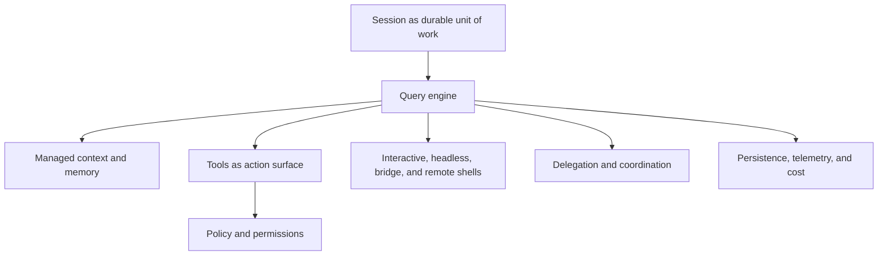

# Chapter 12 - Conclusion

## The design thesis

Claude Code is organized around a simple thesis: a coding assistant is not just a model with a prompt. It is a runtime that must preserve context, govern action, survive interruption, and keep long-running work coherent. Once that thesis is clear, the rest of the architecture stops looking accidental.

The query engine, the tool system, the policy layer, the memory architecture, the session substrate, the swarm model, and the build-shape machinery are not separate embellishments. They are different answers to the same question: **how does an assistant remain useful when the work lasts longer, touches the real world, and has to stay recoverable?**

## The decisions everything else flows from

| Decision | What it enables | What a simpler design would lose |
| --- | --- | --- |
| **Treat the session as the unit of work** | resume, background continuity, remote viewing, cumulative cost and state | every restart becomes a fresh start |
| **Treat the query engine as a workflow runtime** | tool loops, retries, compaction, structural repair | the assistant collapses into a thin request/response client |
| **Treat tools as the main execution surface** | one governed action grammar across local, remote, and delegated work | side effects fragment into incompatible subsystems |
| **Treat context as a managed architecture** | prompt stability, memory hygiene, attachment-based updates, compaction support | the model sees one brittle prompt blob that decays over time |
| **Treat policy as part of capability composition** | permissions, sandboxing, settings provenance, enterprise control | safety becomes a weak wrapper around already-planned behavior |
| **Treat runtime shells as projections of one core** | REPL, headless, bridge, remote, and coordinated multi-agent operation | each mode becomes a separate mini-product |

## The architecture in one picture

## Why Claude Code looks larger than a simple assistant

Claude Code looks large because it refuses several simplifying assumptions that smaller assistants often make:

- that one prompt/response pair is the natural unit of work
- that action can be bolted on after generation
- that safety can be added after capability
- that extensions can live outside the main execution model
- that restarts are acceptable boundaries between pieces of work

Instead, Claude Code assumes the opposite. Work may last for hours. It may involve tools, approvals, background tasks, remote viewers, and delegated workers. It may need to survive compaction, restart, or transport changes. Once those assumptions are accepted, the surrounding architecture becomes proportionate rather than excessive.

## What simpler designs would miss

A thinner design could absolutely be easier to explain. It could also do less of what Claude Code is trying to preserve.

- A pure chat architecture would lose operational continuity.
- A loose plugin host would lose the coherence of one governed capability model.
- A stateless tool runner would lose session repair, resume, and long-lived memory hygiene.
- A single-process single-agent shell would lose the ability to coordinate specialized workers safely.

Claude Code is therefore distinctive not because it has one unusual subsystem, but because it treats **continuity, action, policy, and extensibility as first-class concerns at the same time**.

## Final architectural takeaway

The deepest idea in Claude Code is that software-engineering assistance is operational work, not only conversational work. That is why the product centers sessions instead of prompts, tools instead of text alone, policy instead of after-the-fact warnings, and recovery instead of disposable turns. Read through that lens, the architecture is coherent: Claude Code is a durable orchestration system for agentic software engineering that happens to present itself through a terminal interface.
