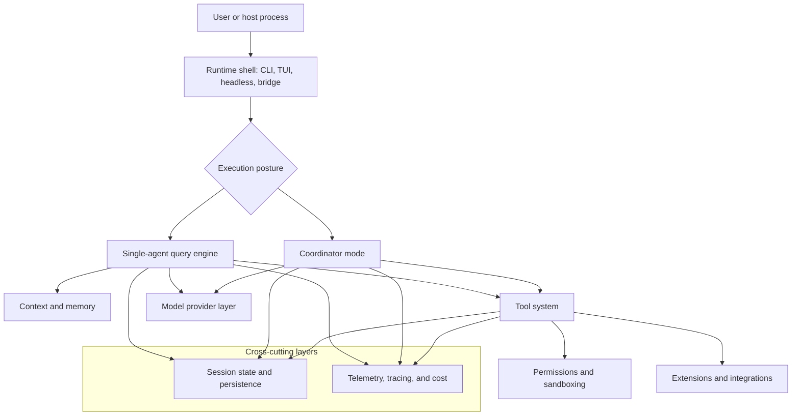

# Claude Code Deep Dive

Claude Code Deep Dive is a book-length architectural study of Claude Code. It explains how Claude Code turns a terminal interface into a session-oriented orchestration system for software engineering work.

## Reading order

| Chapter | Focus |
| --- | --- |
| [00 - Preface](./00-preface.md) | Audience, scope, assumptions, and how to read the book |
| [01 - Overview](./01-overview.md) | System purpose, major layers, and Claude Code's overall mental model |
| [02 - Query Engine and Conversation Lifecycle](./02-query-engine-and-conversation-lifecycle.md) | The main agent loop: prompt assembly, streaming, retries, compaction, and turn control |
| [03 - Context, Memory, and Prompt Assets](./03-context-memory-and-prompt-assets.md) | Instruction loading, memory layers, cache-aware prompt shaping, and attachment-based context surfacing |
| [04 - Tool System and Execution Model](./04-tool-system-and-execution-model.md) | Tool contracts, orchestration, result shaping, and delegated execution |
| [05 - Safety, Configuration, and Policy](./05-safety-configuration-and-policy.md) | Permissions, sandboxing, settings layering, policy enforcement, and enterprise controls |
| [06 - Interaction Model and CLI Surface](./06-interaction-model-and-cli-surface.md) | REPL/TUI, slash commands, keybindings, rendering, and user-facing control flow |
| [07 - Startup and Execution Modes](./07-startup-and-execution-modes.md) | Boot flow, mode selection, initialization work, and runtime topology |
| [08 - Integrations and Extensibility](./08-integrations-and-extensibility.md) | Providers, MCP, plugins, skills, LSP, and extension points |
| [09 - Sessions, Remote Control, and Background Work](./09-sessions-remote-and-background-work.md) | Persistence, resume, bridge flows, tasks, worktrees, and durable long-running work |
| [10 - Multi-Agent Coordination and Swarm Architecture](./10-multi-agent-coordination-and-swarm-architecture.md) | Coordinator mode, teammate backends, mailbox protocols, permission sync, and team state |
| [11 - Operations, Observability, and Build Shape](./11-operations-observability-and-build-shape.md) | Feature flags, telemetry, tracing, cost, and packaging constraints |
| [12 - Conclusion](./12-conclusion.md) | The system-level synthesis: what makes Claude Code architecturally distinctive |

## Top-level mental model

## How to use this book

- Start with the Preface if you want scope, audience, and shared reading assumptions before the architecture chapters.
- Start with Chapter 1 if you want the overall shape.
- Start with Chapters 2 to 5 if you mainly care about how the agent thinks, acts, and stays inside policy.
- Read Chapters 6 and 7 together if you care about the user surface and the runtime postures that assemble it.
- Start with Chapter 8 if you mainly care about providers, MCP, plugins, skills, and other extension layers.
- Start with Chapters 9 and 10 if you care about long-running work, resume, and coordinated multi-agent execution.
- End with Chapter 12 for the system-level synthesis.

## Conventions used in the chapters

- File paths are used to anchor explanations to the implementation.
- The emphasis is on architectural intent and subsystem relationships, not on line-by-line walkthroughs.
- Mermaid diagrams are used as conceptual maps; they illustrate structure and flow rather than exact implementation detail.
